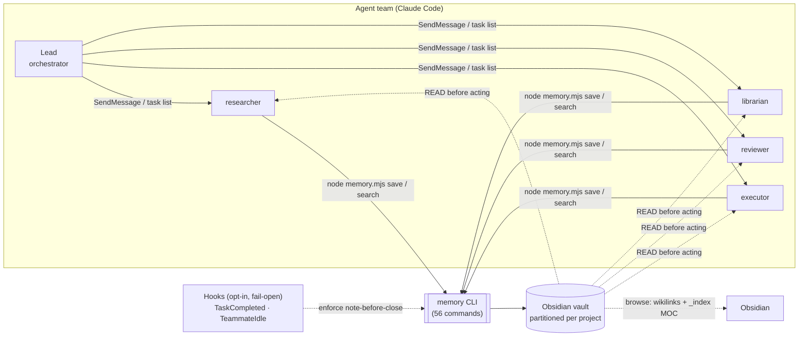
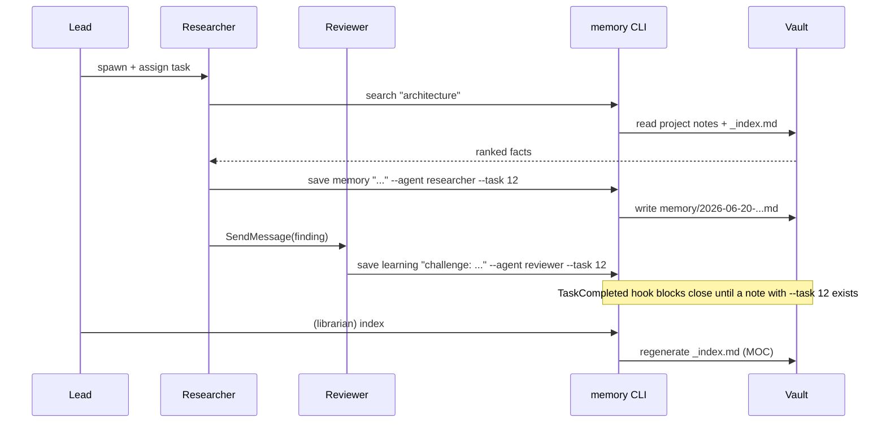
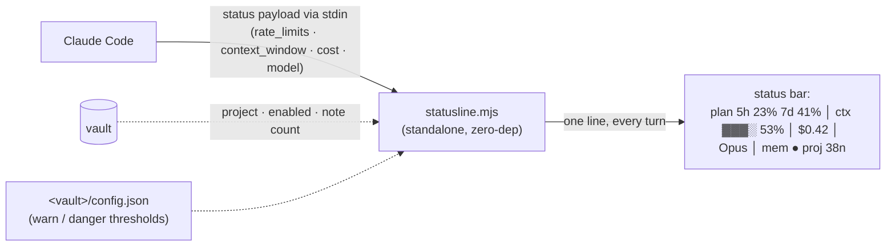
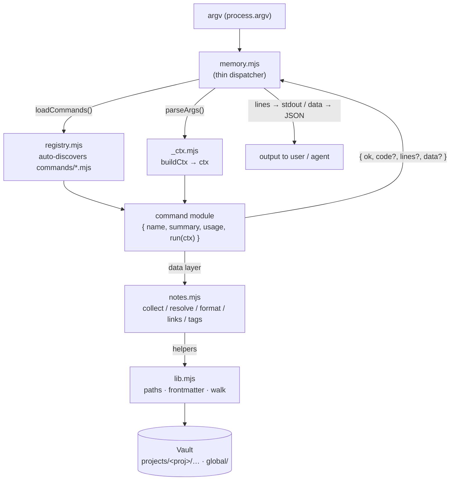
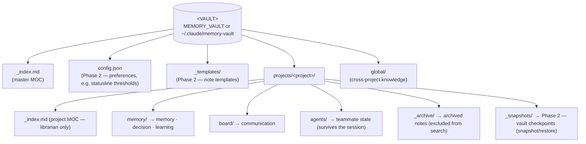
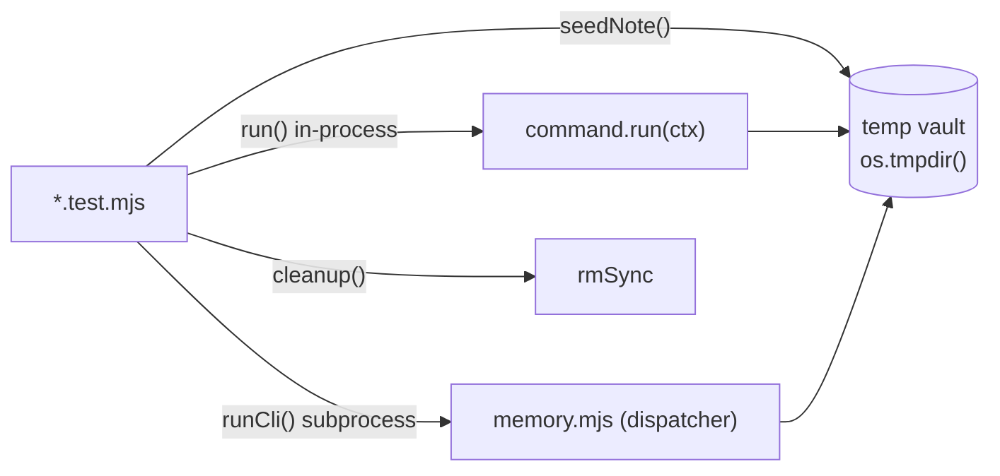

<div align="center">


&nbsp;

[](https://nodejs.org)
[](https://docs.anthropic.com/en/docs/claude-code)
[](#9-design-invariants)
[](#8-testing)
[](LICENSE)

**A zero-dependency Node.js (ESM) CLI that gives a Claude Code _agent team_ a shared brain — one that survives every session.**

[**Quick start**](#3-setup-2-min) &nbsp;·&nbsp; [**Commands**](#7-command-reference-56) &nbsp;·&nbsp; [**Feature guide**](docs/FEATURES.md) &nbsp;·&nbsp; [**Architecture**](docs/ARCHITECTURE.md)

<sub>created by **Matheus Chiodi (MChiodi)**</sub>

</div>

> [!NOTE]
> **In one line:** a Claude Code _agent team_ forgets everything when a teammate's context window
> closes. AgentTeam-Memory gives the team a shared, auditable **Obsidian vault** plus a tiny
> discipline — *read memory before acting, write a note after each deliverable* — so decisions,
> facts and progress **persist across sessions**.

<div align="center"></div>

## Table of contents

- [Table of contents](#table-of-contents)
- [1. Why it exists](#1-why-it-exists)
- [2. How it fits together](#2-how-it-fits-together)
- [⭐ Real-time usage status line](#-real-time-usage-status-line)
- [3. Setup (~2 min)](#3-setup-2-min)
- [4. What the setup does](#4-what-the-setup-does)
- [5. Runtime architecture](#5-runtime-architecture)
- [6. Vault structure](#6-vault-structure)
- [7. Command reference (56)](#7-command-reference-56)
  - [Core](#core)
  - [Navigation \& reading](#navigation--reading)
  - [Tags](#tags)
  - [Knowledge graph (wikilinks)](#knowledge-graph-wikilinks)
  - [Analytics](#analytics)
  - [Validation \& cleanup](#validation--cleanup)
  - [Lifecycle](#lifecycle)
  - [Backup \& portability](#backup--portability)
  - [Real-time, observability \& productivity](#real-time-observability--productivity)
  - [Visualization — see the system at a glance](#visualization--see-the-system-at-a-glance)
  - [Context packs \& token economy — more agent output, same tokens](#context-packs--token-economy--more-agent-output-same-tokens)
  - [Daily flow — terminal vibe-coding commands](#daily-flow--terminal-vibe-coding-commands)
  - [Knowledge \& metrics](#knowledge--metrics)
- [8. Testing](#8-testing)
- [9. Design invariants](#9-design-invariants)
- [10. Repository layout](#10-repository-layout)
- [11. Uninstall / change vault](#11-uninstall--change-vault)
- [12. License](#12-license)

<div align="center"></div>

## 1. Why it exists

Claude Code _agent teams_ (a lead that spawns peer teammates talking over `SendMessage` and a shared
task list) have two structural gaps:

| Gap | Consequence |
| --- | --- |
| **No shared memory** | Each teammate owns its own context window. Facts, decisions and learnings die when the window closes. |
| **No session resume** | When a teammate ends, its context is gone. A new session restarts from zero. |

The net effect is rework, re-litigated decisions and knowledge lost between sessions.

**The fix:** a central **Obsidian vault**, partitioned per project, is the one artifact that survives.
The CLI imposes a tiny discipline on every teammate — **READ memory before acting**, **WRITE an atomic
note after each deliverable** — and two opt-in hooks (`TaskCompleted`, `TeammateIdle`) can *enforce* it
per project. Notes are Markdown with YAML frontmatter, linked by `[[wikilinks]]`, browsable in Obsidian
and versionable in git.

<div align="center"></div>

## 2. How it fits together

<div align="center">
  
</div>

**The core loop in one sentence:** every teammate **reads** the vault before acting and **writes** an
atomic note after each deliverable — the single discipline that turns four forgetful agents into a team
with one durable, shared brain. The full picture:



A typical team session, end to end:



<div align="center"></div>

## ⭐ Real-time usage status line

*Phase 2.* See **how much of your plan you've already spent** — plus how full the context window is and
the session cost — passively in the Claude Code footer, refreshed every turn. No more manual `/usage`.



| Segment | Source | Shows |
| --- | --- | --- |
| `plan 5h % · 7d %` | `rate_limits.{five_hour,seven_day}.used_percentage` | how much of your Claude.ai Pro/Max plan is spent — the `/usage` numbers. Degrades to `plan n/a` on API key/Bedrock/Vertex. |
| `ctx [bar] %` | `context_window` (fallback: transcript) | context-window fill, rescaled for 1M windows (works around Claude Code [#36725](https://github.com/anthropics/claude-code/issues/36725)) |
| `$0.42` | `cost.total_cost_usd` | session cost so far |
| `mem ● proj 38n` | the vault (`lib.mjs`) | detected project, enforcement flag, note count |

It is a **standalone entrypoint** — not a registry command — on purpose: it runs on every screen refresh,
needs **stdin**, and emits **one line**. So it stays tiny and **never throws** (any error degrades to a
short fallback and exits 0, never breaking the footer).

```bash
node memory-team/statusline.mjs --demo        # preview the line without Claude Code
node memory-team/statusline.mjs --install     # register it in ~/.claude/settings.json (non-destructive)
node memory-team/statusline.mjs --uninstall   # remove it
```

Thresholds (`warn`, `danger`) come from `config set statusline.warn 70` (see the [`config`](#7-command-reference-56) tool).

<div align="center"></div>

## 3. Setup (~2 min)

**Requirements:** Claude Code **≥ 2.1.32**, Node **≥ 18**. Nothing else — the scripts have zero dependencies.

```bash
# 1. get the project
git clone https://github.com/MatheusChiodi/AgentTeam-Memory.git
cd AgentTeam-Memory

# 2. open Claude Code in the folder
claude
```

**3. Run the configuration** — any of these is equivalent:

| Inside Claude Code | Plain terminal |
| --- | --- |
| `/setup` | `node install.mjs` |
| `!node install.mjs` | `node install.mjs --vault D:/MyVault` |

That's it. Open a terminal in **any** project, run `claude`, and agent teams + memory are live.

<div align="center"></div>

## 4. What the setup does

`install.mjs` is **idempotent and non-destructive**. It promotes the system to the **user scope**
(`~/.claude`), so it is global and machine-portable:

- enables agent teams (`CLAUDE_CODE_EXPERIMENTAL_AGENT_TEAMS=1`, `teammateMode: in-process`);
- installs 4 reusable roles into `~/.claude/agents/`: **researcher · executor · reviewer · librarian**;
- registers 2 memory hooks (`TaskCompleted`, `TeammateIdle`) — **opt-in & fail-open**;
- injects the **Memory Protocol** into `~/.claude/CLAUDE.md`;
- scaffolds the central vault (default `~/.claude/memory-vault`), partitioned **per project**.

Your existing `~/.claude/settings.json` is **merged, not overwritten** (a timestamped `.bak` is kept).

<div align="center"></div>

## 5. Runtime architecture

Phase 0 refactored the original monolith into a **modular command architecture**: a thin dispatcher
(`memory.mjs`) auto-discovers commands via a *registry*, each command is an isolated module under
`commands/`, and all vault access lives in a *data layer* (`notes.mjs`) over low-level helpers
(`lib.mjs`). Adding a tool = dropping one file — **no central edit, no merge conflicts** between
parallel contributors — and every command is unit-testable in isolation.



**Layers** (each pure layer never reaches the one above it):

| Layer | File | Responsibility |
| --- | --- | --- |
| Helpers | `lib.mjs` | Vault/project path resolution, partitions, `parseFM`, `walk`, `slug`, `today`, `isEnabled`. Never reads argv, never prints. |
| Data layer | `notes.mjs` | `collectNotes`, `resolveNotes` (loose ref), `formatNote` (canonical round-trip), `wikilinksOf`, `tagHistogram`. Never calls `console`/`exit`. |
| Handlers | `commands/*.mjs` | One command per file; `run(ctx) → { ok, code?, lines?, data? }`. Reads env only via `ctx`. |
| Context | `commands/_ctx.mjs` | `parseArgs` (flag parser), `buildCtx` (injects `ROOT`/`PROJECT`, overridable in tests), `fail()`. |
| Registry | `commands/registry.mjs` | Auto-discovery: imports every `*.mjs` except `_*` and itself; registers those with `name` + `run`. |
| Dispatcher | `memory.mjs` | argv parse, help, dispatch, render `lines`/`data`/`code`, error → exit. Knows no individual command. |
| Hooks | `hooks/*.mjs` | Opt-in enforcement via Claude Code stdin JSON. Never block if the project has no `.memory-team` marker. |
| Installer | `install.mjs` | Promotes runtime to `~/.claude`, merges `settings.json`, injects protocol, scaffolds vault. |

**Command contract** — every command is an ESM default export:

```js
export default {
  name: 'list',                          // unique key in the registry
  summary: 'List/filter notes …',        // 1 line; shown in help
  usage: 'list [--type t] [--tag x] …',  // signature; shown in help
  run(ctx) {                             // ctx = { ROOT, PROJECT, pos, opt, json, all }
    return { ok: true, lines: [...], data: [...] };
  },
};
```

When `--json` is passed **and** `data` is populated, the dispatcher emits **only** the JSON of `data`
(not `lines`) — so pipelines, CI and other agents consume structured output.

<div align="center"></div>

## 6. Vault structure



`<project>` defaults to `slug(basename(cwd))` (override with `MEMORY_PROJECT`). Note routing by type:

| Type | Destination | Naming |
| --- | --- | --- |
| `memory` `decision` `learning` | `memory/` (or `global/memory` with `--global`) | `YYYY-MM-DD-<title-slug>.md` (`-2`, `-3`… on collision) |
| `communication` | `board/` | `YYYY-MM-DD-<from>-to-<to>.md` |
| `state` | `agents/` (always per-project) | `<name-slug>.md` (idempotent: never overwrites) |

Frontmatter is rewritten in a **canonical order** (`FM_ORDER`) on every mutation, so maintenance
commands (`retag`, `rename`, `move`, `archive`) produce stable, diffable notes and never drop unknown
fields they don't understand.

<div align="center"></div>

## 7. Command reference (56)

CLI entry point: `node "~/.claude/memory-team/memory.mjs" <command>`. Run `… memory.mjs help` for the
live list. `--json` works on every read command; `<ref>` is a **loose reference** resolved by
`resolveNotes` (exact basename → slug fragment → name/summary substring).

### Core

| Command | Purpose |
| --- | --- |
| `where` | show vault path, detected project, enabled status and note count |
| `enable` | opt-in: make the `TaskCompleted`/`TeammateIdle` hooks enforce memory in this project |
| `search <term\|tag> [--all] [--json]` | rank notes for a term/tag (current project + global; `--all` = every project) |
| `save <type> "<title>" [--agent n --summary "…" --tags "a,b" --task id --from n --to n --global]` | write an atomic note (`memory\|decision\|learning\|communication\|state`) |
| `index [--all]` | regenerate the per-project `_index.md` and the master index |

### Navigation & reading

| Command | Purpose |
| --- | --- |
| `list [--type t] [--tag x] [--agent a] [--project p] [--since YYYY-MM-DD] [--limit n] [--archived] [--all] [--json]` | list notes with filters |
| `show <ref> [--json]` | print a note resolved by reference |
| `recent [n] [--all] [--json]` | show the N most recent notes (default 10) |

### Tags

| Command | Purpose |
| --- | --- |
| `tags [--all] [--json]` | tag frequency histogram across the project (`--all` = every project) |
| `tag <ref> [--add "a,b"] [--remove "c,d"] [--json]` | add/remove tags on one note |
| `retag <old> <new> [--all] [--json]` | rename a tag across all notes (old → new) |

### Knowledge graph (wikilinks)

| Command | Purpose |
| --- | --- |
| `backlinks <ref> [--all] [--json]` | notes that link **to** the target |
| `links <ref> [--all] [--json]` | outgoing wikilinks of a note (resolved vs dangling) |
| `graph [--all] [--json]` | render the wikilink graph as **Mermaid** (resolved edges only) |
| `orphans [--all] [--json]` | notes with no inbound and no outbound links |

### Analytics

| Command | Purpose |
| --- | --- |
| `stats [--all] [--json]` | totals, byType/byAgent/byProject, top tags, oldest/newest |
| `timeline [--since YYYY-MM-DD] [--limit n] [--all] [--json]` | notes grouped by creation day (newest first) |

### Validation & cleanup

| Command | Purpose |
| --- | --- |
| `validate [--all] [--json]` | lint frontmatter (type/summary/created/agent + broken links); **exit 1** on any problem |
| `dedupe [--all] [--json]` | report suspected duplicates (same title slug or identical summary) |
| `prune [--apply] [--all] [--json]` | find empty/placeholder notes; **dry-run** by default, `--apply` archives them |

### Lifecycle

| Command | Purpose |
| --- | --- |
| `archive <ref> [--restore]` | move a note to `_archive/`; `--restore` brings it back |
| `move <ref> <targetProject>` | relocate a note to another project (updates `fm.project`) |
| `rename <ref> <new title…>` | rename note + file + heading (keeps any date prefix) |

### Backup & portability

| Command | Purpose |
| --- | --- |
| `export [--format json\|md] [--out file] [--all]` | export notes as JSON (default) or concatenated Markdown |
| `import <file> [--project p]` | import notes from a JSON bundle (from `export`) |

### Real-time, observability & productivity

| Command | Purpose |
| --- | --- |
| `statusline.mjs` *(standalone)* | render plan/context/cost in the Claude Code status bar, every turn — see [the section above](#-real-time-usage-status-line) |
| `usage [--dir path] [--since YYYY-MM-DD] [--limit n] [--save] [--json]` | historical cost/token ledger over session transcripts, by day & project |
| `watch [--all]` | live-tail: print each new note as teammates write it (Ctrl-C to stop) |
| `digest [--since YYYY-MM-DD] [--all] [--save] [--json]` | Markdown summary of a window, grouped by agent & type (`--save` writes the real digest body) |
| `doctor [--settings path] [--json]` | read-only health check (vault, settings, hooks, statusline, integrity); **exit 1** on any failure |
| `config list \| get <key> \| set <key> <value> [--json]` | read/adjust preferences in `<vault>/config.json` (e.g. statusline thresholds) |
| `template list \| <name> "<title>" [--agent n --tags "a,b" --global]` | scaffold a note from a built-in or `_templates/` template (won't clobber an existing `state`) |
| `pin <ref> [--off] \| pin --list [--all] [--json]` | pin a note so it floats to the top of `search`/`list`/`recent` |
| `snapshot [--id id] \| --list [--all] \| --restore <id>` | checkpoint the vault to `_snapshots/`; `--restore` is a **true reset** (safety snapshot first) |
| `relate <ref> [--top N] [--apply] [--all] [--json]` | suggest (or `--apply`) `[[wikilinks]]` for a note by tag/summary similarity |

### Visualization — see the system at a glance

| Command | Purpose |
| --- | --- |
| `diagram [--scope links\|tags\|agents\|types] [--save] [--all] [--json]` | render the vault as a **Mermaid** `flowchart` — the note/wikilink graph (`links`) or a note↔tag/agent/type map; labels sanitized so they never break the parser |
| `mindmap <ref> \| --tag <t> [--depth N] [--save] [--all] [--json]` | a **Mermaid `mindmap`** centered on one note (its wikilinks + tag-siblings) or on a tag (its carriers) |
| `dashboard [--all] [--json]` | one ANSI panel: project + enabled, totals by type/agent (mini-bars), recent notes, pins, orphans |
| `tree [--by type\|agent] [--depth N] [--all] [--json]` | the vault as a glyphed **tree** (project → type → note), each leaf with a truncated summary |
| `activity [--days N] [--by agent\|type] [--today YYYY-MM-DD] [--json]` | a unicode **sparkline** of notes created per day, with total / average / peak |
| `heatmap [--weeks N] [--today YYYY-MM-DD] [--json]` | a GitHub-style **calendar heatmap** of note creation, intensity by quartile |

### Context packs & token economy — more agent output, same tokens

The heavy lifting (ranking, summarizing, counting, budgeting) is **local and heuristic** — it never spends the LLM. These tools hand an agent a pre-distilled pack instead of making it scan the whole vault.

| Command | Purpose |
| --- | --- |
| `brief [<query>…] [--budget N] [--full] [--all] [--json]` | a **token-budgeted context pack** (pins → query-relevant → recent); never exceeds `--budget` (a note that doesn't fit is dropped whole) |
| `focus <query>… [--top N] [--budget N] [--all] [--json]` | rank notes by relevance to a query and return only those that fit a token / count budget |
| `tokens [<ref>] [--text "…"] [--all] [--json]` | estimate the token cost of a note, the project, or arbitrary text (deterministic, monotonic) |
| `tldr [<ref>] [--sentences N] [--all] [--json]` | an **extractive** TL;DR of a note (or one line per note), no LLM |
| `recap [--since YYYY-MM-DD] [--max N] [--today YYYY-MM-DD] [--json]` | a dense, minimal-token recap of a window, prioritizing `decision`/`state` over `communication` |

### Daily flow — terminal vibe-coding commands

| Command | Purpose |
| --- | --- |
| `plan "<goal>" [--steps "a;b;c"] [--agent n] [--json]` | scaffold a structured **plan** note (Goal / Steps as `- [ ]` / Risks / Done-when) |
| `standup [--since YYYY-MM-DD] [--today YYYY-MM-DD] [--all] [--json]` | a cross-agent **standup**: per agent, what was delivered in the window + last state |
| `handoff [--save] [--all] [--json]` | a **handoff packet** (latest state per agent, open checkboxes, pins, recent decisions) for the next session — agent teams have no resume |
| `todo [--done] [--all] [--json]` · `todo check <ref> "<text>"` | aggregate every open `- [ ]` checkbox across notes; `check` flips one to done (unique match, persisted via `formatNote`) |
| `roadmap [--include learning] [--save] [--all] [--json]` | group `decision` notes into a `YYYY-MM` timeline |

### Knowledge & metrics

| Command | Purpose |
| --- | --- |
| `blockers [--all] [--json]` | surface notes flagged as risk/blocked (by tag or body marker `⚠`/`blocked`/`risco`) |
| `glossary [--min N] [--top N] [--all] [--json]` | a term index of recurring vocabulary across summaries/titles, with source notes |
| `progress [--all] [--json]` | objective metrics: checkboxes done/total (% + bar), fully-checked plans, open blockers |
| `changelog [--since YYYY-MM-DD] [--save] [--today YYYY-MM-DD] [--all] [--json]` | a Markdown changelog from `decision`/`learning` notes, by date |

### Provenance & authorship — forensic watermark

| Command | Purpose |
| --- | --- |
| `whoami [--json]` | show authorship (author/repo/canary) and confirm the forensic watermark is active (see [NOTICE](NOTICE)) |
| `verify <seed>` | prove authorship by supplying the secret pre-image of the public **canary** (`sha256` commitment); **exit 1** on mismatch, **2** on missing seed |

> **Slash commands (orchestration).** `.claude/commands/` ships `/diagram` and `/mindmap` (which **fan
> out** agents to architect a system diagram by subsystem, then a reviewer consolidates and the engine
> materializes the Mermaid), plus `/standup`, `/handoff`, `/recap`, `/plan` as direct wrappers of the
> tools above.

> **Safety guarantees.** Mutating tools (`tag`, `retag`, `prune`, `archive`, `move`, `rename`, `import`)
> rewrite notes via `formatNote` to preserve unknown frontmatter. An ambiguous `<ref>` is reported,
> never guessed. `move`/`rename` have an **anti-clobber guard**: if the destination name already belongs
> to another note they abort instead of overwriting. Nothing is deleted — `prune --apply` archives,
> recoverable via `archive --restore`.

See **[START.md](START.md)** for the full operating guide and ready-to-paste lead prompts.

<div align="center"></div>

## 8. Testing

The suite uses **native `node:test`** — `npm test` → `node --test "memory-team/test/*.test.mjs"` —
keeping the zero-dependency promise. **No mocks:** each test creates a real temporary vault under
`os.tmpdir()` and exercises the real filesystem, only isolated.



Each tool ships at least: a happy-path in-process test, an e2e `runCli` test where the dispatcher
matters (exit code, `--json`, render), edge branches (missing/ambiguous `<ref>`, empty vault), and —
for mutating tools — an assertion that **unknown frontmatter survives the round-trip**.

<div align="center"></div>

## 9. Design invariants

1. **Zero dependencies.** Only `node:*` builtins — tests included.
2. **Pure data layer.** `lib.mjs`/`notes.mjs` never print or `exit`; only commands and the dispatcher do console I/O.
3. **Isolated, testable commands.** Every external dependency enters via `ctx`; no `process.env` inside a `run`.
4. **Add without central edit.** New tool = new file in `commands/`; the registry resolves it.
5. **Non-destructive by default.** Dangerous ops (`prune`) are dry-run until `--apply`; `archive` moves, never deletes.
6. **Stable round-trip.** Mutations rewrite via `formatNote`, preserving unknown fields.
7. **Fail-open hooks, fail-loud CLI.** Hooks never block the team on a bug; the CLI signals errors clearly.

<div align="center"></div>

## 10. Repository layout

```
install.mjs                 # promotes everything to ~/.claude + scaffolds the central vault
.claude/commands/setup.md   # the /setup slash command
memory-team/
  lib.mjs                   # low-level helpers (vault/project resolution, frontmatter, walk)
  notes.mjs                 # data layer (collect/resolve/format notes, wikilinks, tag histogram)
  memory.mjs                # thin dispatcher: argv → command, render lines/data/exit
  render.mjs                # pure presentation primitives (ANSI, bar, sparkline, box, tree, Mermaid escaping)
  analyze.mjs               # pure text analysis (token estimate, extractive summary, query scoring, checkboxes)
  commands/                 # one file per command (registry auto-discovers; 56 commands)
  statusline.mjs            # standalone Claude Code status line (real-time plan/ctx/cost)
  CLAUDE.md                 # Memory Protocol (injected into ~/.claude/CLAUDE.md)
  agents/                   # researcher · executor · reviewer · librarian
  hooks/                    # task-completed.mjs · teammate-idle.mjs (opt-in, fail-open)
  test/                     # node:test suite (real temp vault, no mocks)
.claude/commands/           # slash commands: setup · diagram · mindmap · standup · handoff · recap · plan
docs/                       # FEATURES.md (feature & usage guide) · ARCHITECTURE*.md · USER-STORIES*.md · topic prompt packs
tools/build-guide.mjs       # regenerates docs/system-guide.excalidraw
START.md                    # install + day-to-day operation + lead prompts
```

For a task-oriented tour of **every command with usage methods and examples**, read the
**[Feature & Usage Guide → docs/FEATURES.md](docs/FEATURES.md)**.

For the full design rationale, read the architecture and user-story specs:

| Capability layer | Architecture | User stories |
| --- | --- | --- |
| Core CLI (the command base + data layer) | [docs/ARCHITECTURE.md](docs/ARCHITECTURE.md) | [docs/USER-STORIES.md](docs/USER-STORIES.md) |
| Real-time status line + observability tools | [docs/ARCHITECTURE-PHASE-2.md](docs/ARCHITECTURE-PHASE-2.md) | [docs/USER-STORIES-PHASE-2.md](docs/USER-STORIES-PHASE-2.md) |
| Terminal DX (visualization, token economy, daily flow, knowledge) | [docs/ARCHITECTURE-PHASE-3.md](docs/ARCHITECTURE-PHASE-3.md) | [docs/USER-STORIES-PHASE-3.md](docs/USER-STORIES-PHASE-3.md) |

Topic-specific, ready-to-paste prompt packs live under `docs/` (architecture, review, unit-tests,
bugs, improvements, project-analysis, project-changes, project-validation, vibe-coding).

<div align="center"></div>

## 11. Uninstall / change vault

Re-run `node install.mjs --vault <newdir>` to point at a different vault. To remove: delete
`~/.claude/memory-team`, the 4 files in `~/.claude/agents/`, the `memory-team` block in
`~/.claude/CLAUDE.md`, and the hook/env entries in `~/.claude/settings.json` (restore the `.bak`).

<div align="center"></div>

## 12. License

Released under the **MIT License with a Mandatory Attribution clause** — see **[LICENSE](LICENSE)**.

You may use, copy, modify, distribute and sell this software, **on one condition**:

> **Every use, deployment, demonstration or derivative work — public or private, commercial or not —
> MUST clearly and visibly state that the project was created by Matheus Chiodi (MChiodi).**

The credit must be reasonably visible to end users and/or present in the project documentation
(README, an "About"/credits screen, the startup banner, or release notes), and must not be removed,
hidden or misrepresented. Suggested line:

> *Built on AgentTeam-Memory, created by Matheus Chiodi (MChiodi).*

<div align="center">

—

**AgentTeam-Memory** · created by **Matheus Chiodi (MChiodi)**

</div>
