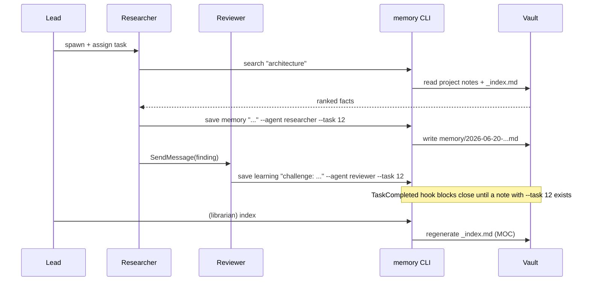
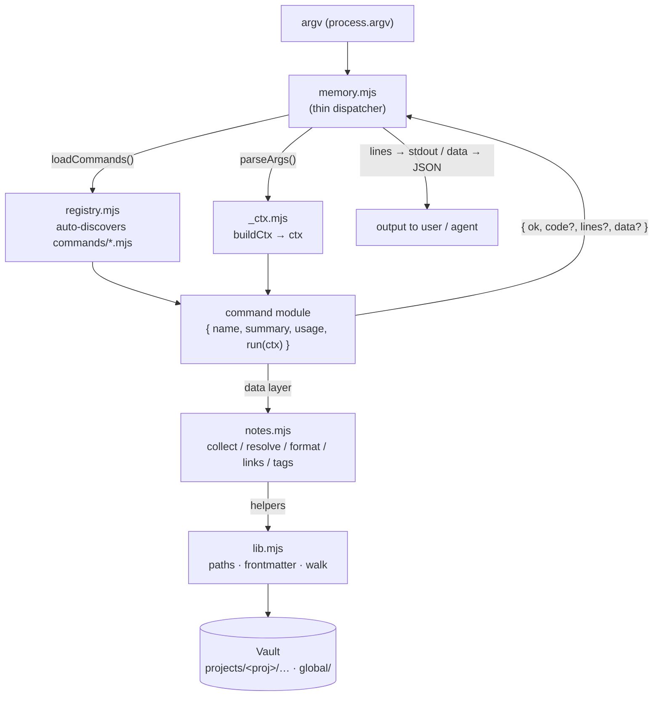
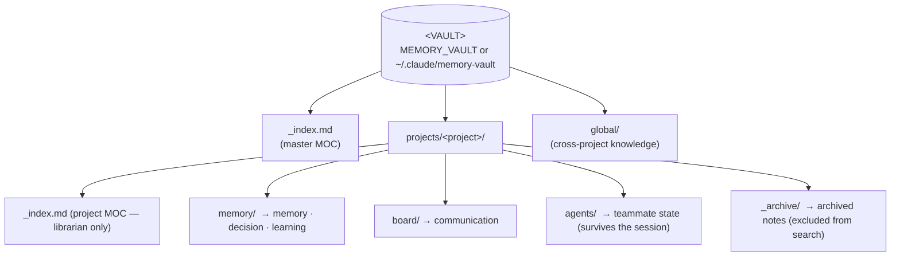
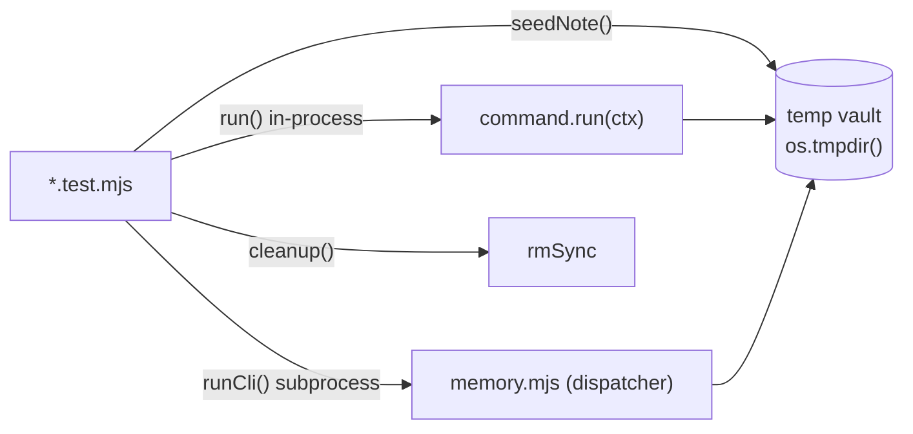

<div align="center">

# AgentTeam-Memory

**Persistent, per-project, auditable memory for Claude Code _agent teams_, backed by an Obsidian vault.**

[](https://nodejs.org)
[](https://docs.anthropic.com/en/docs/claude-code)
[](#9-design-invariants)
[](#8-testing)
[](LICENSE)

*Created by **Matheus Chiodi (MChiodi)**.*

</div>

> A **zero-dependency Node.js (ESM) CLI** that gives a Claude Code agent team a shared brain.
> Install once on any machine; it works in **every** project you open. 25 commands, one Obsidian vault.

---

## Table of contents

1. [Why it exists](#1-why-it-exists)
2. [How it fits together](#2-how-it-fits-together)
3. [Setup (~2 min)](#3-setup-2-min)
4. [What the setup does](#4-what-the-setup-does)
5. [Runtime architecture](#5-runtime-architecture)
6. [Vault structure](#6-vault-structure)
7. [Command reference (25)](#7-command-reference-25)
8. [Testing](#8-testing)
9. [Design invariants](#9-design-invariants)
10. [Repository layout](#10-repository-layout)
11. [Uninstall / change vault](#11-uninstall--change-vault)
12. [License](#12-license)

---

## 1. Why it exists

Claude Code _agent teams_ (a lead that spawns peer teammates talking over `SendMessage` and a shared
task list) have two structural gaps:

| Gap | Consequence |
| --- | --- |
| **No shared memory** | Each teammate owns its own context window. Facts, decisions and learnings die when the window closes. |
| **No session resume** | When a teammate ends, its context is gone. A new session restarts from zero. |

The net effect is rework, re-litigated decisions and knowledge lost between sessions.

**The fix:** a central **Obsidian vault**, partitioned per project, is the one artifact that survives.
The CLI imposes a tiny discipline on every teammate — **READ memory before acting**, **WRITE an atomic
note after each deliverable** — and two opt-in hooks (`TaskCompleted`, `TeammateIdle`) can *enforce* it
per project. Notes are Markdown with YAML frontmatter, linked by `[[wikilinks]]`, browsable in Obsidian
and versionable in git.

---

## 2. How it fits together


A typical team session, end to end:



---

## 3. Setup (~2 min)

**Requirements:** Claude Code **≥ 2.1.32**, Node **≥ 18**. Nothing else — the scripts have zero dependencies.

```bash
# 1. get the project
git clone https://github.com/MatheusChiodi/AgentTeam-Memory.git
cd AgentTeam-Memory

# 2. open Claude Code in the folder
claude
```

**3. Run the configuration** — any of these is equivalent:

| Inside Claude Code | Plain terminal |
| --- | --- |
| `/setup` | `node install.mjs` |
| `!node install.mjs` | `node install.mjs --vault D:/MyVault` |

That's it. Open a terminal in **any** project, run `claude`, and agent teams + memory are live.

---

## 4. What the setup does

`install.mjs` is **idempotent and non-destructive**. It promotes the system to the **user scope**
(`~/.claude`), so it is global and machine-portable:

- enables agent teams (`CLAUDE_CODE_EXPERIMENTAL_AGENT_TEAMS=1`, `teammateMode: in-process`);
- installs 4 reusable roles into `~/.claude/agents/`: **researcher · executor · reviewer · librarian**;
- registers 2 memory hooks (`TaskCompleted`, `TeammateIdle`) — **opt-in & fail-open**;
- injects the **Memory Protocol** into `~/.claude/CLAUDE.md`;
- scaffolds the central vault (default `~/.claude/memory-vault`), partitioned **per project**.

Your existing `~/.claude/settings.json` is **merged, not overwritten** (a timestamped `.bak` is kept).

---

## 5. Runtime architecture

Phase 0 refactored the original monolith into a **modular command architecture**: a thin dispatcher
(`memory.mjs`) auto-discovers commands via a *registry*, each command is an isolated module under
`commands/`, and all vault access lives in a *data layer* (`notes.mjs`) over low-level helpers
(`lib.mjs`). Adding a tool = dropping one file — **no central edit, no merge conflicts** between
parallel contributors — and every command is unit-testable in isolation.



**Layers** (each pure layer never reaches the one above it):

| Layer | File | Responsibility |
| --- | --- | --- |
| Helpers | `lib.mjs` | Vault/project path resolution, partitions, `parseFM`, `walk`, `slug`, `today`, `isEnabled`. Never reads argv, never prints. |
| Data layer | `notes.mjs` | `collectNotes`, `resolveNotes` (loose ref), `formatNote` (canonical round-trip), `wikilinksOf`, `tagHistogram`. Never calls `console`/`exit`. |
| Handlers | `commands/*.mjs` | One command per file; `run(ctx) → { ok, code?, lines?, data? }`. Reads env only via `ctx`. |
| Context | `commands/_ctx.mjs` | `parseArgs` (flag parser), `buildCtx` (injects `ROOT`/`PROJECT`, overridable in tests), `fail()`. |
| Registry | `commands/registry.mjs` | Auto-discovery: imports every `*.mjs` except `_*` and itself; registers those with `name` + `run`. |
| Dispatcher | `memory.mjs` | argv parse, help, dispatch, render `lines`/`data`/`code`, error → exit. Knows no individual command. |
| Hooks | `hooks/*.mjs` | Opt-in enforcement via Claude Code stdin JSON. Never block if the project has no `.memory-team` marker. |
| Installer | `install.mjs` | Promotes runtime to `~/.claude`, merges `settings.json`, injects protocol, scaffolds vault. |

**Command contract** — every command is an ESM default export:

```js
export default {
  name: 'list',                          // unique key in the registry
  summary: 'List/filter notes …',        // 1 line; shown in help
  usage: 'list [--type t] [--tag x] …',  // signature; shown in help
  run(ctx) {                             // ctx = { ROOT, PROJECT, pos, opt, json, all }
    return { ok: true, lines: [...], data: [...] };
  },
};
```

When `--json` is passed **and** `data` is populated, the dispatcher emits **only** the JSON of `data`
(not `lines`) — so pipelines, CI and other agents consume structured output.

---

## 6. Vault structure



`<project>` defaults to `slug(basename(cwd))` (override with `MEMORY_PROJECT`). Note routing by type:

| Type | Destination | Naming |
| --- | --- | --- |
| `memory` `decision` `learning` | `memory/` (or `global/memory` with `--global`) | `YYYY-MM-DD-<title-slug>.md` (`-2`, `-3`… on collision) |
| `communication` | `board/` | `YYYY-MM-DD-<from>-to-<to>.md` |
| `state` | `agents/` (always per-project) | `<name-slug>.md` (idempotent: never overwrites) |

Frontmatter is rewritten in a **canonical order** (`FM_ORDER`) on every mutation, so maintenance
commands (`retag`, `rename`, `move`, `archive`) produce stable, diffable notes and never drop unknown
fields they don't understand.

---

## 7. Command reference (25)

CLI entry point: `node "~/.claude/memory-team/memory.mjs" <command>`. Run `… memory.mjs help` for the
live list. `--json` works on every read command; `<ref>` is a **loose reference** resolved by
`resolveNotes` (exact basename → slug fragment → name/summary substring).

### Core

| Command | Purpose |
| --- | --- |
| `where` | show vault path, detected project, enabled status and note count |
| `enable` | opt-in: make the `TaskCompleted`/`TeammateIdle` hooks enforce memory in this project |
| `search <term\|tag> [--all] [--json]` | rank notes for a term/tag (current project + global; `--all` = every project) |
| `save <type> "<title>" [--agent n --summary "…" --tags "a,b" --task id --from n --to n --global]` | write an atomic note (`memory\|decision\|learning\|communication\|state`) |
| `index [--all]` | regenerate the per-project `_index.md` and the master index |

### Navigation & reading

| Command | Purpose |
| --- | --- |
| `list [--type t] [--tag x] [--agent a] [--project p] [--since YYYY-MM-DD] [--limit n] [--archived] [--all] [--json]` | list notes with filters |
| `show <ref> [--json]` | print a note resolved by reference |
| `recent [n] [--all] [--json]` | show the N most recent notes (default 10) |

### Tags

| Command | Purpose |
| --- | --- |
| `tags [--all] [--json]` | tag frequency histogram across the project (`--all` = every project) |
| `tag <ref> [--add "a,b"] [--remove "c,d"] [--json]` | add/remove tags on one note |
| `retag <old> <new> [--all] [--json]` | rename a tag across all notes (old → new) |

### Knowledge graph (wikilinks)

| Command | Purpose |
| --- | --- |
| `backlinks <ref> [--all] [--json]` | notes that link **to** the target |
| `links <ref> [--all] [--json]` | outgoing wikilinks of a note (resolved vs dangling) |
| `graph [--all] [--json]` | render the wikilink graph as **Mermaid** (resolved edges only) |
| `orphans [--all] [--json]` | notes with no inbound and no outbound links |

### Analytics

| Command | Purpose |
| --- | --- |
| `stats [--all] [--json]` | totals, byType/byAgent/byProject, top tags, oldest/newest |
| `timeline [--since YYYY-MM-DD] [--limit n] [--all] [--json]` | notes grouped by creation day (newest first) |

### Validation & cleanup

| Command | Purpose |
| --- | --- |
| `validate [--all] [--json]` | lint frontmatter (type/summary/created/agent + broken links); **exit 1** on any problem |
| `dedupe [--all] [--json]` | report suspected duplicates (same title slug or identical summary) |
| `prune [--apply] [--all] [--json]` | find empty/placeholder notes; **dry-run** by default, `--apply` archives them |

### Lifecycle

| Command | Purpose |
| --- | --- |
| `archive <ref> [--restore]` | move a note to `_archive/`; `--restore` brings it back |
| `move <ref> <targetProject>` | relocate a note to another project (updates `fm.project`) |
| `rename <ref> <new title…>` | rename note + file + heading (keeps any date prefix) |

### Backup & portability

| Command | Purpose |
| --- | --- |
| `export [--format json\|md] [--out file] [--all]` | export notes as JSON (default) or concatenated Markdown |
| `import <file> [--project p]` | import notes from a JSON bundle (from `export`) |

> **Safety guarantees.** Mutating tools (`tag`, `retag`, `prune`, `archive`, `move`, `rename`, `import`)
> rewrite notes via `formatNote` to preserve unknown frontmatter. An ambiguous `<ref>` is reported,
> never guessed. `move`/`rename` have an **anti-clobber guard**: if the destination name already belongs
> to another note they abort instead of overwriting. Nothing is deleted — `prune --apply` archives,
> recoverable via `archive --restore`.

See **[START.md](START.md)** for the full operating guide and ready-to-paste lead prompts.

---

## 8. Testing

The suite uses **native `node:test`** — `npm test` → `node --test "memory-team/test/*.test.mjs"` —
keeping the zero-dependency promise. **No mocks:** each test creates a real temporary vault under
`os.tmpdir()` and exercises the real filesystem, only isolated.



Each tool ships at least: a happy-path in-process test, an e2e `runCli` test where the dispatcher
matters (exit code, `--json`, render), edge branches (missing/ambiguous `<ref>`, empty vault), and —
for mutating tools — an assertion that **unknown frontmatter survives the round-trip**.

---

## 9. Design invariants

1. **Zero dependencies.** Only `node:*` builtins — tests included.
2. **Pure data layer.** `lib.mjs`/`notes.mjs` never print or `exit`; only commands and the dispatcher do console I/O.
3. **Isolated, testable commands.** Every external dependency enters via `ctx`; no `process.env` inside a `run`.
4. **Add without central edit.** New tool = new file in `commands/`; the registry resolves it.
5. **Non-destructive by default.** Dangerous ops (`prune`) are dry-run until `--apply`; `archive` moves, never deletes.
6. **Stable round-trip.** Mutations rewrite via `formatNote`, preserving unknown fields.
7. **Fail-open hooks, fail-loud CLI.** Hooks never block the team on a bug; the CLI signals errors clearly.

---

## 10. Repository layout

```
install.mjs                 # promotes everything to ~/.claude + scaffolds the central vault
.claude/commands/setup.md   # the /setup slash command
memory-team/
  lib.mjs                   # low-level helpers (vault/project resolution, frontmatter, walk)
  notes.mjs                 # data layer (collect/resolve/format notes, wikilinks, tag histogram)
  memory.mjs                # thin dispatcher: argv → command, render lines/data/exit
  commands/                 # one file per command (registry auto-discovers; 25 commands)
  CLAUDE.md                 # Memory Protocol (injected into ~/.claude/CLAUDE.md)
  agents/                   # researcher · executor · reviewer · librarian
  hooks/                    # task-completed.mjs · teammate-idle.mjs (opt-in, fail-open)
  test/                     # node:test suite (real temp vault, no mocks)
docs/                       # ARCHITECTURE.md · USER-STORIES.md · system-guide.excalidraw
tools/build-guide.mjs       # regenerates docs/system-guide.excalidraw
START.md                    # install + day-to-day operation + lead prompts
```

For the full design rationale, the 10 features and the 20-tool expansion, read
**[docs/ARCHITECTURE.md](docs/ARCHITECTURE.md)** and **[docs/USER-STORIES.md](docs/USER-STORIES.md)**.

---

## 11. Uninstall / change vault

Re-run `node install.mjs --vault <newdir>` to point at a different vault. To remove: delete
`~/.claude/memory-team`, the 4 files in `~/.claude/agents/`, the `memory-team` block in
`~/.claude/CLAUDE.md`, and the hook/env entries in `~/.claude/settings.json` (restore the `.bak`).

---

## 12. License

Released under the **MIT License with a Mandatory Attribution clause** — see **[LICENSE](LICENSE)**.

You may use, copy, modify, distribute and sell this software, **on one condition**:

> **Every use, deployment, demonstration or derivative work — public or private, commercial or not —
> MUST clearly and visibly state that the project was created by Matheus Chiodi (MChiodi).**

The credit must be reasonably visible to end users and/or present in the project documentation
(README, an "About"/credits screen, the startup banner, or release notes), and must not be removed,
hidden or misrepresented. Suggested line:

> *Built on AgentTeam-Memory, created by Matheus Chiodi (MChiodi).*

<div align="center">

—

**AgentTeam-Memory** · created by **Matheus Chiodi (MChiodi)**

</div>
