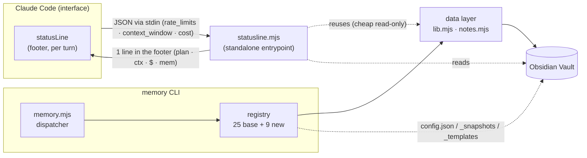
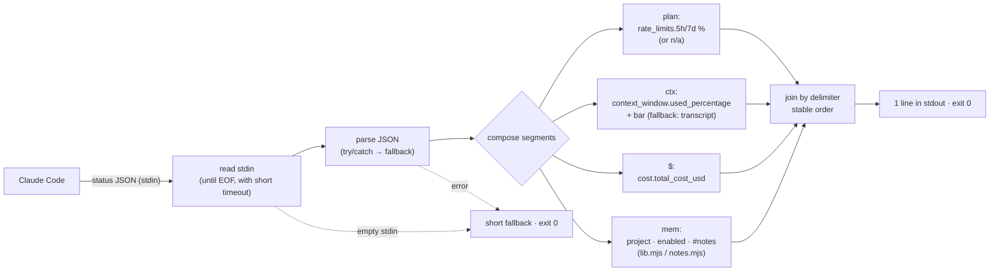
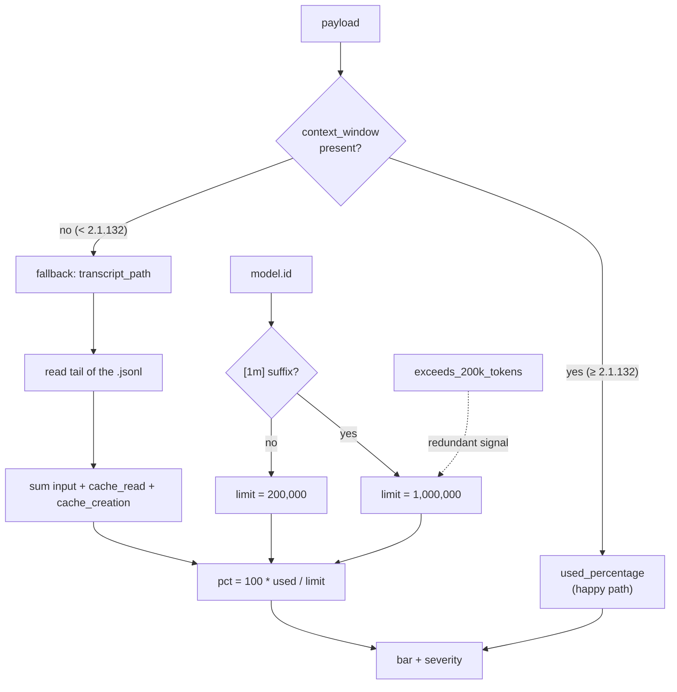
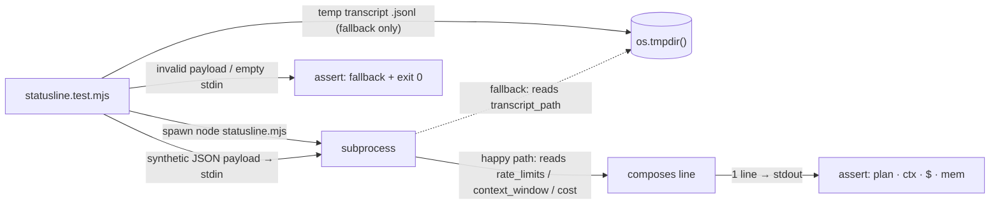

# AgentTeam-Memory — Architecture (Phase 2)

> Reference document for **Phase 2** of the `memory-team` memory CLI: real-time observability
> and native integration with Claude Code.
> Status: **delivered** — extends the base of **25 commands** (Phase 0/1) with **1 standalone
> entrypoint** (`statusline.mjs`) and **9 new** registry tools (F12–F20) → **34 commands +
> statusline**. Implemented, tested (suite **232/232**, no mocks), and adversarially reviewed
> (author ≠ reviewer; 5 blockers caught with green tests, including the statusline's 1M-window
> recompute — Claude Code bug #36725).
> Source of truth for the features: [`USER-STORIES-PHASE-2.md`](./USER-STORIES-PHASE-2.md).
> Architectural base that this phase preserves: [`ARCHITECTURE.md`](./ARCHITECTURE.md).

---

## 1. Phase 2 overview

Phase 0/1 delivered a **zero-dependency Node.js ESM CLI** with 25 commands on top of a pure
data layer (`lib.mjs` + `notes.mjs`), a thin dispatcher (`memory.mjs`), and a registry with auto-discovery
(`commands/registry.mjs`). The Obsidian vault is the *agent team*'s persistent memory. All of this
still holds: Phase 2 **adds, it does not rewrite**.

The theme of the phase is to make the vault **overflow into Claude Code's own interface** and gain
**live operation**:

- **Passive observability** — the plan usage (5h/7d windows), the % of the context window, and the
  session's USD cost appear in the Claude Code footer, updated every turn, without running
  `/usage` by hand (**F11**).
- **Usage history and audit** — aggregation of cost/tokens from sessions (**F12**).
- **Live operation** — track notes in real time (**F13**), close a session with an automatic
  summary (**F14**), diagnose the installation (**F15**).
- **Vault ergonomics** — central configuration (**F16**), note templates (**F17**), pinning of
  key notes (**F18**), snapshots/checkpoints (**F19**), and wikilink suggestion (**F20**).

### Preserved invariants

Phase 2 keeps **all** of Phase 1's design principles (zero-dep, pure data layer, addition without
central editing, non-destructive by default, stable round-trip, fail-open in hooks / fail-loud in the
CLI — see §6) and none of the 25 base tools changes its contract. The only point where the phase **steps out** of the
`{ ok, lines?, data? }` contract is deliberate and documented: `statusline.mjs` (standalone
entrypoint, §2) and `watch` (continuous stream, §3), both required by the "real-time" nature.



---

## 2. statusLine architecture (F11) — the central piece

The statusLine is the flagship feature and the **only** one that is not a registry command. It is a
**standalone entrypoint**: `memory-team/statusline.mjs`, executable on its own.

### 2.1 Why standalone and not a registry command

| Reason | Detail |
| --- | --- |
| **Performance / high frequency** | Claude Code re-invokes the statusLine on **every screen update** (per turn). Loading `loadCommands()` (which imports **all** ~34 registry modules) every turn is wasteful. The standalone imports only `lib.mjs`/`notes.mjs` and part of `node:fs` — a minimal time budget. |
| **Needs stdin** | Claude Code delivers the session state as **JSON via stdin**. The `ctx` built by `buildCtx` (`commands/_ctx.mjs`) injects `ROOT`/`PROJECT`/`pos`/`opt` — it does **not** expose stdin. The command contract was never designed to read a stdin payload. |
| **Different output contract** | Commands return `{ ok, lines?, data? }` and the dispatcher renders `lines.join('\n')` or the JSON of `data`. The statusLine must emit **exactly one line** to stdout (and nothing to stderr). Fitting that into the `{ lines, data }` shape would be forcing it. |

> In one sentence: the registry is for **commands invoked by the agent** (`node memory.mjs <cmd>`); the
> statusLine is a **Claude Code UI callback**, with its own trigger, input, and output.

### 2.2 The payload already delivers what `/usage` shows

> **Factual correction (Claude Code official docs, v2.1.x).** The statusLine JSON **already exposes**
> plan, context, and cost usage. On the happy path **there is no need to parse the transcript** — it only
> becomes a fallback for versions `< 2.1.132`. Relevant fields:

| Payload field | Use in the statusline |
| --- | --- |
| `rate_limits.five_hour.used_percentage` | % of the plan in the **5h** window (`plan` segment). |
| `rate_limits.seven_day.used_percentage` | % of the plan in the **7-day** window (`plan` segment). |
| `rate_limits.{five_hour,seven_day}.resets_at` | epoch of the reset per window → "resets in 2h13". |
| `context_window.used_percentage` | % of the **context window** already used (`ctx` segment, bar). |
| `context_window.context_window_size` | window size (for the bar / absolute text). |
| `context_window.current_usage.{input,output,cache_creation,cache_read}_input_tokens` | breakdown of tokens in use. |
| `cost.total_cost_usd` | **USD cost** of the session (client-side estimate) — `$` segment. |
| `model.display_name` / `model.id` | active model; `model.id` still decides the limit in the fallback. |
| `workspace.current_dir` | directory → detected project (`mem` segment). |
| `exceeds_200k_tokens` | redundant signal of "large window already blown". |

> **Honest caveat (becomes a criterion, not a broken promise):** `rate_limits` only exists for
> **Claude.ai Pro/Max** accounts and **after the 1st response** of the session. With **API key / Bedrock / Vertex**
> the field does not exist (those plans have no 5h/7d window). When absent, the `plan` segment
> degrades to **`n/a`** and the focus shifts to `ctx` + `$` — without inventing a plan number.

### 2.3 Pipeline



`Claude Code → JSON via stdin → statusline.mjs → 1 line in the footer.` All in **a single pass**, with no
external dependencies (maintains the zero-dep invariant).

### 2.4 `plan:` segment — real-time plan usage (US-033)

The **primary source** of the pain ("how much of my plan have I already spent without running `/usage`"):

- Reads `rate_limits.five_hour.used_percentage` and `rate_limits.seven_day.used_percentage` and renders
  e.g.: `plan 5h 23% · 7d 41%` — exactly what `/usage` reports.
- Optionally shows each window's `resets_at` as relative time ("resets in 2h13").
- **Honest degradation:** `rate_limits` absent (API key / Bedrock / Vertex, or before the 1st
  response) → `plan n/a`, without inventing a number.

### 2.5 `ctx:` segment — context window (US-034)

- **Happy path:** `context_window.used_percentage` (and `context_window_size`) straight from the payload.
- **Fallback** (only versions `< 2.1.132`, where `context_window` does not exist): sum the last
  `usage` of the `transcript_path` (`.jsonl`) — `input_tokens + cache_read_input_tokens +
  cache_creation_input_tokens` — over the model's window limit (**200000** default; **1000000**
  when `model.id` indicates an extended window, e.g. the `[1m]` suffix; `exceeds_200k_tokens` as a
  redundant signal). Reads **only the tail** of the `.jsonl` (time budget, US-046).
- Renders a textual **bar** (§2.8).



### 2.6 `$:` segment — cost (US-034)

The session cost is **not** recomputed: it uses `cost.total_cost_usd` straight from the payload (Claude
Code's own client-side estimate), formatted (e.g.: `$0.42`).

### 2.7 `mem:` segment (US-035)

Reuses the data layer **without reimplementing** vault resolution:

- **Detected project**: from `workspace.current_dir` of the payload (or cwd as fallback) via
  `projectName(dir)` from `lib.mjs`.
- **Enabled flag**: `isEnabled(dir)` from `lib.mjs` (the `.memory-team` marker or global enforcement).
- **Note count**: `collectNotes(ROOT, { project })` from `notes.mjs` — **per project + global**,
  never `--all` (cheap read; scanning the entire vault every turn would violate US-046).

`ROOT` comes from `vaultRoot()`. The segment comes out as `mem: <project>[●] <n> notes` (with the enabled
marker), composing with the rest.

### 2.6 Bar and severity (US-034)

- Textual bar of context usage: `[█████░░░░░] 53%`.
- **Severity thresholds** configurable with embedded defaults (`warn=70%`, `danger=90%`):
  below `warn` neutral; at `warn`, an attention marker; at `danger`, a critical marker.
- Uses **ANSI** colors when the terminal supports them and degrades to plain text when not.
- The thresholds come from the **central config** (F16): `config get statusline.warn` / `statusline.danger`,
  with embedded defaults when absent.

### 2.9 Stable composition of the segments (US-035)

Fixed order separated by a legible delimiter: **`plan · ctx · $ · mem`**. The order is
deterministic (it does not depend on the presence of optional fields — absent segments degrade to
`n/a` or are omitted, but do not reorder) so that the footer does not "jump" between turns.

### 2.10 Resilience (US-033 / US-046)

The statusLine **never** brings down the Claude Code render:

- empty stdin → short fallback, **exit 0**.
- invalid JSON (`try/catch` on parse) → short fallback, **exit 0**.
- `rate_limits` absent (API key / Bedrock / Vertex, or before the 1st response) → `plan n/a`, continues with
  `ctx` + `$` + `mem`, **exit 0**.
- `context_window` absent (version `< 2.1.132`) → tries the transcript fallback; if that too
  is missing/unreadable, it omits the `ctx` segment, continues with the rest, **exit 0**.
- Any unexpected exception → caught, short fallback, **exit 0**, nothing on stderr.
- **Low time budget**: a single pass; on the happy path it does not even touch the transcript; when it must,
  it reads only the tail of the `.jsonl`; never `--all`.

Golden rule: **the statusline never throws to Claude Code** and **never locks up** (§6).

### 2.11 Activation, installation, and refresh (US-036)

Activated via `~/.claude/settings.json`, the `statusLine` block. Claude Code accepts, in addition to `type` and
`command`, the keys `padding`, `refreshInterval` (in seconds, **minimum 1s**), and
`hideVimModeIndicator`. The statusLine updates after each response / compact / mode switch, with a
**300ms debounce**:

```json
{
  "statusLine": {
    "type": "command",
    "command": "node \"C:/Users/<user>/.claude/memory-team/statusline.mjs\"",
    "padding": 0,
    "refreshInterval": 1
  }
}
```

Installable by the script itself (an entrypoint with its own subcommands, **not** via the registry):

- `statusline.mjs --install` — **non-destructive, idempotent merge** in `~/.claude/settings.json`:
  adds/updates only the `statusLine` block, preserves the rest of the file. Without a `settings.json`, it creates
  a minimal valid one. Existing **invalid** JSON → a clear error, it does **not** overwrite. (Mirrors the
  base's `install.mjs` merge discipline.)
- `statusline.mjs --uninstall` — removes **only** the `statusLine` block written by memory-team.
- `statusline.mjs --demo` — runs the pipeline with an embedded sample payload (without needing
  Claude Code) and prints the line as it would appear — manual test and living documentation.

### 2.12 What the statusline covers — and what it does not

**Covers** (primary source, from the payload): **plan** usage (`rate_limits` 5h/7d), **context**
(`context_window`), and **cost** (`cost.total_cost_usd`) — exactly what `/usage` shows, now
passive in the footer. **Does not cover** the plan when the payload does not bring `rate_limits` (API key / Bedrock
/ Vertex, or before the 1st response): in those cases the segment honestly becomes `plan n/a` and the focus
shifts to context + cost. Optionally, a **configurable cost ceiling** (via `config`/F16,
e.g. `statusline.budgetUsd`) renders a budget bar relative to a user-defined
limit — useful precisely when `rate_limits` is not available.

---

## 3. New registry tools (F12–F20)

Each tool is a `commands/<name>.mjs` module that exports the canonical contract
`{ name, summary, usage, run(ctx) }` and returns `{ ok, code?, lines?, data? }` — identical to the base
(§4 of [`ARCHITECTURE.md`](./ARCHITECTURE.md)). Addition without central editing: each file is
auto-discovered by `loadCommands()`. All read tools populate `data` for the cross-cutting `--json`
(F10). Mutations rewrite via `formatNote` preserving unknown frontmatter.

### F12 — `usage` (usage/cost ledger) · US-037

- **Signature:** `usage [--since YYYY-MM-DD] [--limit n] [--save] [--json]`
- **What it does:** scans the accessible session transcripts (`.jsonl`) and aggregates `cost`/tokens by
  **day** and by **project**; window adjustable via `--since`/`--limit`.
- **Reuses:** the same transcript `usage` parsing as `statusline.mjs` (extracted into a shared
  helper), `save`/`formatNote` for `--save`, `today()` from `lib.mjs`.
- **Mutates?** Read-only by default. With `--save` it persists the aggregate as a `memory` note (tag `usage`).
- **`--json`:** `{ totalUsd, totalTokens, byDay: [...], byProject: [...] }`.
- **Edge:** no transcripts → clear message, `data` zeroed, **exit 0** (it is not an error).

### F13 — `watch` (live tail) · US-038

- **Signature:** `watch [--all]`
- **What it does:** watches the project partition (and global) with `fs.watch`; on each **created** note
  it prints `HH:MM type/agent — title` (with `summary` when present). Exits cleanly on `SIGINT`.
- **Reuses:** `partition`/`globalPart` from `lib.mjs` for the directories; `readNote` from `notes.mjs`
  to extract type/agent/title of the new note.
- **Mutates?** Read-only. **Outside the `lines/data` contract** (continuous stream, long-running process) — a documented
  exception, analogous to the statusline. It does not re-read pre-existing notes; it dedups duplicate FS events.

### F14 — `digest` (session summary) · US-039

- **Signature:** `digest [--since YYYY-MM-DD] [--save] [--json]`
- **What it does:** collects the window's notes (`--since`, default = today) and generates markdown grouped by
  **agent** and by **type**, with `title — summary` bullets and counts.
- **Reuses:** `collectNotes`/`readNote` from `notes.mjs`; `formatNote` for `--save`.
- **Mutates?** Read-only by default. With `--save` it persists as a `memory` note (tag `digest`), with
  wikilinks to the source notes.
- **`--json`:** `{ since, total, byAgent, byType, notes: [...] }`.
- **Edge:** empty window → valid digest ("no notes in the window"), **exit 0**.

### F15 — `doctor` (health check) · US-040

- **Signature:** `doctor [--json]`
- **What it does:** verifies the vault is accessible and writable; `settings.json` parseable; the
  `TaskCompleted`/`TeammateIdle` hooks registered; `statusLine` pointing to an existing script;
  vault integrity (reuses the `validate` logic).
- **Reuses:** `vaultRoot` from `lib.mjs`; the `validate` command (F6) for the integrity check.
- **Mutates?** Read-only (diagnostic). It fixes nothing; it reports and, when useful, suggests the fix.
- **Output:** each check is `✓/✗/⚠ name — detail`; **exit 1** if there is at least one `✗`.
- **`--json`:** `{ ok, checks: [{ name, status, detail }] }`.

### F16 — `config` (central configuration) · US-041

- **Signature:** `config list | get <k> | set <k> <v> [--json]`
- **What it does:** `list` shows all keys + effective value (default vs. override); `get <k>`
  prints one; `set <k> <v>` persists to a `config.json` at the vault root.
- **Reuses:** `vaultRoot` from `lib.mjs`; it is the **source** of the statusline thresholds (F11/US-034) and of the
  custom context limit.
- **Mutates?** `set` writes `config.json` (it is not a note — it does not go through `formatNote`). `list`/`get`
  read-only.
- **Details:** known keys have an embedded default; an unknown key in `set` is accepted but
  warned about, in `get` it returns empty without an error; values typed enough (numbers become numbers).

### F17 — `template` (note templates) · US-042

- **Signature:** `template list | template <name> "<title>" [--json]`
- **What it does:** `list` lists embedded templates + those of the vault in `_templates/`; `template <name>
  "<title>"` creates a note filling the body with the skeleton and the canonical frontmatter.
- **Reuses:** the naming/archiving and writing of `save` (e.g.: slug collision → suffix `-2`);
  `today()`/`projectName()` for placeholders.
- **Mutates?** Creates a note (writes via the same path as `save`). `list` read-only.
- **Details:** placeholders `{{title}}`, `{{date}}`, `{{project}}`, `{{agent}}`; a nonexistent
  template → an error listing the valid ones, **exit 1**, nothing written.

### F18 — `pin` (note highlighting) · US-043

- **Signature:** `pin <ref> | pin <ref> --off | pin --list [--json]`
- **What it does:** `pin <ref>` adds `pinned: true` to the frontmatter; `--off` removes it; `--list` lists
  the pinned ones. Pinned notes sort **before** the rest in `search`/`list`/`recent`.
- **Reuses:** `resolveNotes` from `notes.mjs`; **`formatNote`** for the round-trip (preserves `pinned`
  as an unknown key, appended at the end — the stable round-trip invariant).
- **Mutates?** Yes (rewrites frontmatter). Ambiguous/nonexistent `<ref>` → a clear error, **exit 1**, without
  writing.
- **Integration:** `list`/`recent`/`search` now sort `pinned` first (a minimal sorting
  adjustment in those commands, without changing the contract).

### F19 — `snapshot` (vault checkpoint) · US-044

- **Signature:** `snapshot | snapshot --list | snapshot --restore <id> [--json]`
- **What it does:** `snapshot` creates a dated checkpoint in `_snapshots/<timestamp>/` (a copy of the notes,
  without recursion over `_snapshots`); `--list` lists the existing ones with date and count; `--restore
  <id>` restores the vault from a checkpoint.
- **Reuses:** the serialization base of `export` (F9) where it makes sense; `walk`/`collectNotes`.
- **Mutates?** `snapshot` creates (non-destructive). `--restore` is **destructive** → it requires the explicit flag
  (US-031 invariant) and takes a safety snapshot **beforehand**.
- **`--json`:** `{ id, path, count }` on creation; the list on listing.

### F20 — `relate` (wikilink suggestion) · US-045

- **Signature:** `relate <ref> [--apply] [--json]`
- **What it does:** ranks other notes by similarity (tags in common > summary terms > type),
  ignoring those already linked; shows the top-N with score and reason.
- **Reuses:** `resolveNotes`/`collectNotes`/`wikilinksOf`/`tagHistogram` from `notes.mjs`; `formatNote`
  for `--apply`.
- **Mutates?** Dry-run by default (suggestion only). `--apply` adds the top ones to the note's `related`
  (rewrites via `formatNote`), **non-destructive** over what already exists.
- **`--json`:** `[{ name, score, reason }]`; no candidates → a clear empty list, **exit 0**.

### Summary table of the new tools

> `<ref>` = a loose reference resolved by `resolveNotes`. **Mutating** tools rewrite via
> `formatNote`. Read tools populate `data` for the cross-cutting `--json` (F10).

| # | Tool/entrypoint | Signature | Feature | Type | Mutates? |
| --- | --- | --- | --- | --- | --- |
| ⭐ | `statusline.mjs` | `statusline.mjs [--install\|--uninstall\|--demo]` | F11 | standalone (stdin → 1 line) | settings.json (installation) |
| 26 | `usage` | `usage [--since d][--limit n][--save][--json]` | F12 | registry | only with `--save` (note) |
| 27 | `watch` | `watch [--all]` | F13 | registry (continuous stream) | no |
| 28 | `digest` | `digest [--since d][--save][--json]` | F14 | registry | only with `--save` (note) |
| 29 | `doctor` | `doctor [--json]` (exit 1 if any `✗`) | F15 | registry | no |
| 30 | `config` | `config list\|get <k>\|set <k> <v> [--json]` | F16 | registry | `set` → `config.json` |
| 31 | `template` | `template list \| template <name> "<title>"` | F17 | registry | creates note |
| 32 | `pin` | `pin <ref> [--off] \| pin --list [--json]` | F18 | registry | yes (frontmatter) |
| 33 | `snapshot` | `snapshot [--list] [--restore <id>] [--json]` | F19 | registry | creates / destructive restore |
| 34 | `relate` | `relate <ref> [--apply] [--json]` | F20 | registry | only with `--apply` (`related`) |

---

## 4. Extended vault structure

Phase 2 adds new artifacts to the vault root and to the project partition, **without** changing the
existing structure (§5 of [`ARCHITECTURE.md`](./ARCHITECTURE.md)):

```
<VAULT>/
├── _index.md                              # (base) master MOC
├── config.json                            # NEW (F16) — central config; typed numbers
├── _snapshots/                            # NEW (F19) — dated checkpoints
│   └── <timestamp>/                       #   copy of the notes (no _snapshots recursion)
├── _templates/                            # NEW (F17) — vault note templates (+ embedded in the code)
│   └── <name>.md
├── projects/
│   └── <project>/
│       ├── memory/   YYYY-MM-DD-<slug>.md # (base) + `usage` (F12) and `digest` (F14) tag notes
│       ├── board/                         # (base)
│       ├── agents/                        # (base)
│       └── _archive/                      # (base)
└── global/                                # (base)
```

Relevant notes:

- **`config.json`** lives at the **vault root** (not in a partition) — it is cross-project by nature
  (statusline thresholds, date format, custom context limit).
- **`_snapshots/`** and **`_templates/`** start with `_`, so they are already ignored by `walk`
  (`name.startsWith('.')` does not catch them, but the snapshot copy excludes `_snapshots` explicitly to
  avoid recursion; `collectNotes` walks the known bases and does not include these service directories).
- **The `usage`/`digest` tag notes** are normal `memory` notes (created by `usage --save` /
  `digest --save`); they appear in searches and in the graph like any other, distinguished only by the tag.

---

## 5. Tests

Mirrors §8 of [`ARCHITECTURE.md`](./ARCHITECTURE.md): native **`node:test`**, **no mocks**, each
test with a temporary real vault under `os.tmpdir()`. Phase 2 extends this (US-047): every new tool
comes with tests.

### 5.1 Registry tools (F12–F20)

They reuse the helpers from `test/_helpers.mjs`:

- **happy path in-process** (`run`) with asserts on `res.ok`/`res.data`;
- **e2e via `runCli`** when it depends on the dispatcher (exit code, `--json`, render);
- **edge branches**: nonexistent/ambiguous `<ref>`, empty vault, empty window, missing flags;
- **mutating** tools (`pin`, `relate --apply`, `template`): an assert that unknown frontmatter
  survives the round-trip via `formatNote`;
- `doctor`: an assert of the **exit code** (1 with any `✗`);
- `snapshot --restore`: an assert that it requires the flag and takes the safety snapshot beforehand;
- `usage`/`digest`: feed synthetic transcripts/notes and assert the aggregation.

### 5.2 `statusline.mjs` (F11)

Since it is standalone (reads stdin, emits 1 line), the test exercises it as a **subprocess** feeding it a
**synthetic payload via stdin** and asserting the segments of the output line:



Minimum cases:
- **happy path** (payload with `rate_limits` + `context_window` + `cost`) → line with `plan 5h%·7d%`,
  `ctx %` and bar, `$` and `mem`, all correct;
- **`rate_limits` absent** → `plan n/a`, the other segments present;
- **`context_window` absent** (`< 2.1.132`) → falls into the **transcript fallback**; `model.id` with
  `[1m]` → 1M limit; `exceeds_200k_tokens` → danger marker;
- **empty stdin / invalid JSON / missing transcript** → **fallback + exit 0**;
- **`--demo`** → sample line without stdin.

The full suite (`npm test`) keeps passing entirely, with **no regression** in the 25 base tools.

---

## 6. Design principles (kept + new)

Kept from Phase 1 (§9 of [`ARCHITECTURE.md`](./ARCHITECTURE.md)):

1. **Zero dependencies.** Only `node:*` builtins — applies to `statusline.mjs` and to the tests.
2. **Pure data layer.** `lib.mjs`/`notes.mjs` never print nor `exit`; only commands, the dispatcher,
   and the standalone entrypoint do console I/O.
3. **Addition without central editing.** Each new tool (F12–F20) = a file in `commands/`. The registry
   resolves it. (`statusline.mjs` is the justified exception — §2.1.)
4. **Non-destructive by default.** `usage`/`digest`/`relate` only write with `--save`/`--apply`;
   `snapshot --restore` requires an explicit flag and backs up beforehand.
5. **Stable round-trip.** `pin`/`relate --apply` rewrite via `formatNote` preserving unknown
   fields.
6. **Fail-open in hooks, fail-loud in the CLI.** Registry commands signal errors clearly
   (exit ≠ 0); the hooks never lock up the team.

New, specific to Phase 2:

7. **Real-time is cheap and fail-proof.** The live features (statusline, watch) execute in
   a single pass and add no dependency. The statusline consumes the ready-made payload (`rate_limits`,
   `context_window`, `cost`) and only touches the transcript in the fallback — and even then, it reads only the tail; it never
   uses `--all` (US-046).
8. **The statusline never brings down the render.** Any error (empty stdin, invalid JSON, missing
   transcript, exception) degrades to a short fallback and **exits 0** — it never throws to Claude Code,
   never locks up. It is the one rule that overrides "fail-loud in the CLI" of principle 6, because it is on the
   UI's critical path.
