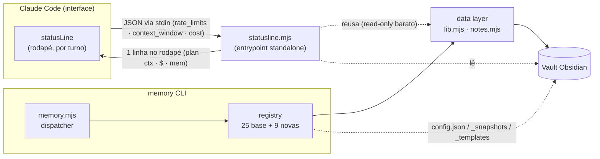
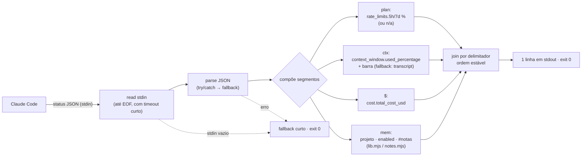
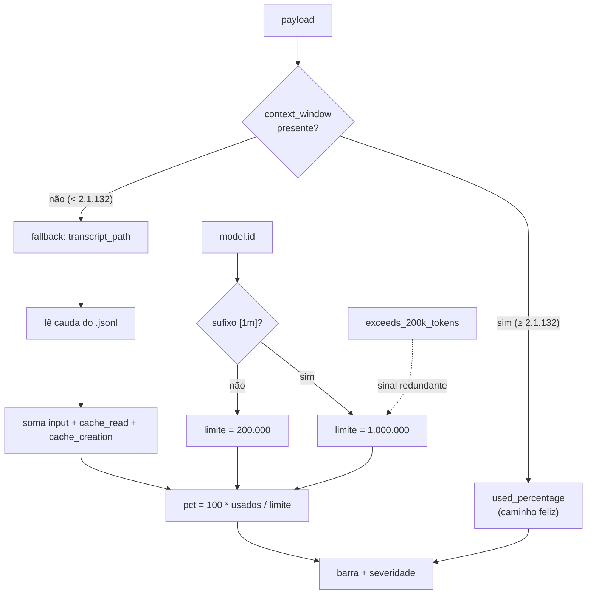
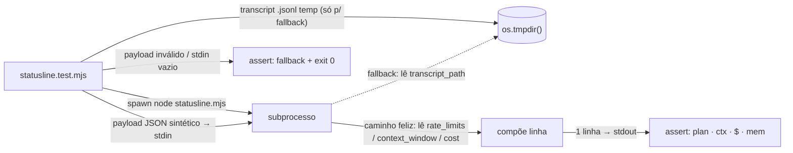

# AgentTeam-Memory — Arquitetura (Fase 2)

> Documento de referência da **Fase 2** do CLI de memória do `memory-team`: observabilidade
> em tempo real e integração nativa com o Claude Code.
> Estado: **entregue** — estende a base de **25 comandos** (Fase 0/1) com **1 entrypoint
> standalone** (`statusline.mjs`) e **9 tools** novas de registry (F12–F20) → **34 comandos +
> statusline**. Implementado, testado (suíte **232/232**, sem mocks) e revisado adversarialmente
> (autor ≠ revisor; 5 bloqueantes pegos com testes verdes, incluindo o recálculo de janela 1M do
> statusline — bug Claude Code #36725).
> Fonte da verdade das features: [`USER-STORIES-PHASE-2.md`](./USER-STORIES-PHASE-2.md).
> Base arquitetural que esta fase preserva: [`ARCHITECTURE.md`](./ARCHITECTURE.md).

---

## 1. Visão geral da Fase 2

A Fase 0/1 entregou um **CLI Node.js ESM zero-dependency** com 25 comandos sobre um data layer
puro (`lib.mjs` + `notes.mjs`), um dispatcher fino (`memory.mjs`) e um registry com auto-discovery
(`commands/registry.mjs`). O vault Obsidian é a memória persistente do *agent team*. Tudo isso
continua valendo: a Fase 2 **adiciona, não reescreve**.

O tema da fase é fazer o vault **transbordar para a própria interface do Claude Code** e ganhar
**operação ao vivo**:

- **Observabilidade passiva** — o uso do plano (janelas de 5h/7d), a % de janela de contexto e o
  custo USD da sessão aparecem no rodapé do Claude Code, atualizados a cada turno, sem rodar
  `/usage` na mão (**F11**).
- **Histórico e auditoria de uso** — agregação de custo/tokens das sessões (**F12**).
- **Operação ao vivo** — acompanhar notas em tempo real (**F13**), fechar sessão com sumário
  automático (**F14**), diagnosticar a instalação (**F15**).
- **Ergonomia do vault** — configuração central (**F16**), templates de nota (**F17**), pin de
  notas-chave (**F18**), snapshots/checkpoints (**F19**) e sugestão de wikilinks (**F20**).

### Invariantes preservadas

A Fase 2 mantém **todos** os princípios de design da Fase 1 (zero-dep, data layer puro, adição sem
edição central, não-destrutivo por padrão, round-trip estável, fail-open nos hooks / fail-loud no
CLI — ver §6) e nenhuma das 25 tools da base muda de contrato. O único ponto onde a fase **sai** do
contrato `{ ok, lines?, data? }` é deliberado e documentado: o `statusline.mjs` (entrypoint
standalone, §2) e o `watch` (stream contínuo, §3), ambos por exigência da natureza "tempo real".



---

## 2. Arquitetura do statusLine (F11) — a peça central

O statusLine é a feature-estrela e a **única** que não é um comando do registry. Ela é um
**entrypoint standalone**: `memory-team/statusline.mjs`, executável por si só.

### 2.1 Por que standalone e não um comando do registry

| Razão | Detalhe |
| --- | --- |
| **Performance / alta frequência** | O Claude Code reinvoca o statusLine a **cada atualização de tela** (por turno). Carregar `loadCommands()` (que importa **todos** os ~34 módulos do registry) a cada turno é desperdício. O standalone importa só `lib.mjs`/`notes.mjs` e parte de `node:fs` — orçamento de tempo mínimo. |
| **Precisa de stdin** | O Claude Code entrega o estado da sessão como **JSON via stdin**. O `ctx` montado por `buildCtx` (`commands/_ctx.mjs`) injeta `ROOT`/`PROJECT`/`pos`/`opt` — **não** expõe stdin. O contrato de comando nunca foi pensado para ler um payload de stdin. |
| **Contrato de saída diferente** | Comandos devolvem `{ ok, lines?, data? }` e o dispatcher renderiza `lines.join('\n')` ou o JSON de `data`. O statusLine deve emitir **exatamente uma linha** em stdout (e nada em stderr). Encaixar isso no shape `{ lines, data }` seria forçar a barra. |

> Em uma frase: o registry é para **comandos invocados pelo agente** (`node memory.mjs <cmd>`); o
> statusLine é um **callback de UI do Claude Code**, com gatilho, entrada e saída próprios.

### 2.2 O payload já entrega o que o `/usage` mostra

> **Correção factual (doc oficial do Claude Code, v2.1.x).** O JSON do statusLine **já expõe**
> uso de plano, contexto e custo. No caminho feliz **não é preciso parsear o transcript** — ele só
> vira fallback para versões `< 2.1.132`. Campos relevantes:

| Campo do payload | Uso no statusline |
| --- | --- |
| `rate_limits.five_hour.used_percentage` | % do plano na janela de **5h** (segmento `plan`). |
| `rate_limits.seven_day.used_percentage` | % do plano na janela de **7 dias** (segmento `plan`). |
| `rate_limits.{five_hour,seven_day}.resets_at` | epoch do reset por janela → "reabre em 2h13". |
| `context_window.used_percentage` | % da **janela de contexto** já usada (segmento `ctx`, barra). |
| `context_window.context_window_size` | tamanho da janela (para a barra / texto absoluto). |
| `context_window.current_usage.{input,output,cache_creation,cache_read}_input_tokens` | detalhamento de tokens em uso. |
| `cost.total_cost_usd` | **custo USD** da sessão (estimativa client-side) — segmento `$`. |
| `model.display_name` / `model.id` | modelo ativo; `model.id` ainda decide o limite no fallback. |
| `workspace.current_dir` | diretório → projeto detectado (segmento `mem`). |
| `exceeds_200k_tokens` | sinal redundante de "janela grande já estourada". |

> **Ressalva honesta (vira critério, não promessa furada):** `rate_limits` só existe para contas
> **Claude.ai Pro/Max** e **após a 1ª resposta** da sessão. Com **API key / Bedrock / Vertex** o
> campo não existe (esses planos não têm janela de 5h/7d). Quando ausente, o segmento `plan`
> degrada para **`n/a`** e o foco recai sobre `ctx` + `$` — sem inventar número de plano.

### 2.3 Pipeline



`Claude Code → JSON via stdin → statusline.mjs → 1 linha no rodapé.` Tudo em **uma passada**, sem
dependências externas (mantém a invariante zero-dep).

### 2.4 Segmento `plan:` — uso do plano em tempo real (US-033)

A **fonte primária** da dor ("quanto do meu plano já gastei sem rodar `/usage`"):

- Lê `rate_limits.five_hour.used_percentage` e `rate_limits.seven_day.used_percentage` e renderiza
  ex.: `plan 5h 23% · 7d 41%` — exatamente o que o `/usage` reporta.
- Opcionalmente mostra `resets_at` de cada janela como tempo relativo ("reabre em 2h13").
- **Degradação honesta:** `rate_limits` ausente (API key / Bedrock / Vertex, ou antes da 1ª
  resposta) → `plan n/a`, sem inventar número.

### 2.5 Segmento `ctx:` — janela de contexto (US-034)

- **Caminho feliz:** `context_window.used_percentage` (e `context_window_size`) direto do payload.
- **Fallback** (apenas versões `< 2.1.132`, onde `context_window` não existe): somar a última
  `usage` do `transcript_path` (`.jsonl`) — `input_tokens + cache_read_input_tokens +
  cache_creation_input_tokens` — sobre o limite da janela do modelo (**200000** padrão; **1000000**
  quando o `model.id` indica janela estendida, ex. sufixo `[1m]`; `exceeds_200k_tokens` como sinal
  redundante). Lê **só a cauda** do `.jsonl` (orçamento de tempo, US-046).
- Renderiza uma **barra** textual (§2.8).



### 2.6 Segmento `$:` — custo (US-034)

O custo da sessão **não** é recomputado: usa `cost.total_cost_usd` direto do payload (estimativa
client-side do próprio Claude Code), formatado (ex.: `$0.42`).

### 2.7 Segmento `mem:` (US-035)

Reaproveita o data layer **sem reimplementar** resolução de vault:

- **Projeto detectado**: de `workspace.current_dir` do payload (ou cwd como fallback) via
  `projectName(dir)` de `lib.mjs`.
- **Flag enabled**: `isEnabled(dir)` de `lib.mjs` (marcador `.memory-team` ou enforcement global).
- **Contagem de notas**: `collectNotes(ROOT, { project })` de `notes.mjs` — **por projeto + global**,
  nunca `--all` (leitura barata; varrer o vault inteiro a cada turno violaria US-046).

`ROOT` vem de `vaultRoot()`. O segmento sai como `mem: <projeto>[●] <n> notes` (com marcador de
enabled), compondo com os demais.

### 2.6 Barra e severidade (US-034)

- Barra textual do uso de contexto: `[█████░░░░░] 53%`.
- **Limiares** de severidade configuráveis com defaults embutidos (`warn=70%`, `danger=90%`):
  abaixo de `warn` neutro; em `warn`, marcador de atenção; em `danger`, marcador crítico.
- Usa cores **ANSI** quando o terminal suporta e degrada para texto puro quando não.
- Os limiares saem da **config central** (F16): `config get statusline.warn` / `statusline.danger`,
  com defaults embutidos quando ausentes.

### 2.9 Composição estável dos segmentos (US-035)

Ordem fixa e separada por delimitador legível: **`plan · ctx · $ · mem`**. A ordem é
determinística (não depende da presença de campos opcionais — segmentos ausentes degradam para
`n/a` ou são omitidos, mas não reordenam) para que o rodapé não "pule" entre turnos.

### 2.10 Resiliência (US-033 / US-046)

O statusLine **nunca** derruba a render do Claude Code:

- stdin vazio → fallback curto, **exit 0**.
- JSON inválido (`try/catch` no parse) → fallback curto, **exit 0**.
- `rate_limits` ausente (API key / Bedrock / Vertex, ou antes da 1ª resposta) → `plan n/a`, segue com
  `ctx` + `$` + `mem`, **exit 0**.
- `context_window` ausente (versão `< 2.1.132`) → tenta o fallback de transcript; se este também
  faltar/for ilegível, omite o segmento `ctx`, segue com o resto, **exit 0**.
- Qualquer exceção inesperada → capturada, fallback curto, **exit 0**, nada em stderr.
- **Orçamento de tempo baixo**: uma passada; no caminho feliz nem toca o transcript; quando precisa,
  lê só a cauda do `.jsonl`; nunca `--all`.

Regra de ouro: **o statusline nunca lança para o Claude Code** e **nunca trava** (§6).

### 2.11 Ativação, instalação e refresh (US-036)

Ativado via `~/.claude/settings.json`, bloco `statusLine`. O Claude Code aceita, além de `type` e
`command`, as chaves `padding`, `refreshInterval` (em segundos, **mínimo 1s**) e
`hideVimModeIndicator`. O statusLine atualiza após cada resposta / compact / troca de modo, com um
**debounce de 300ms**:

```json
{
  "statusLine": {
    "type": "command",
    "command": "node \"C:/Users/<user>/.claude/memory-team/statusline.mjs\"",
    "padding": 0,
    "refreshInterval": 1
  }
}
```

Instalável pelo próprio script (entrypoint com subcomandos próprios, **não** pelo registry):

- `statusline.mjs --install` — **merge não-destrutivo e idempotente** em `~/.claude/settings.json`:
  adiciona/atualiza só o bloco `statusLine`, preserva o resto do arquivo. Sem `settings.json`, cria
  um mínimo válido. JSON existente **inválido** → erro claro, **não** sobrescreve. (Espelha a
  disciplina de merge do `install.mjs` da base.)
- `statusline.mjs --uninstall` — remove **apenas** o bloco `statusLine` escrito pelo memory-team.
- `statusline.mjs --demo` — roda o pipeline com um payload de exemplo embutido (sem precisar do
  Claude Code) e imprime a linha como apareceria — teste manual e doc viva.

### 2.12 O que o statusline cobre — e o que não cobre

**Cobre** (fonte primária, do payload): uso do **plano** (`rate_limits` 5h/7d), **contexto**
(`context_window`) e **custo** (`cost.total_cost_usd`) — exatamente o que o `/usage` mostra, agora
passivo no rodapé. **Não cobre** o plano quando o payload não traz `rate_limits` (API key / Bedrock
/ Vertex, ou antes da 1ª resposta): nesses casos o segmento vira `plan n/a` honestamente e o foco
recai sobre contexto + custo. Opcionalmente, um **teto de custo configurável** (via `config`/F16,
ex. `statusline.budgetUsd`) renderiza uma barra de orçamento relativa a um limite definido pelo
usuário — útil justamente quando `rate_limits` não está disponível.

---

## 3. Novas tools de registry (F12–F20)

Cada tool é um módulo `commands/<nome>.mjs` que exporta o contrato canônico
`{ name, summary, usage, run(ctx) }` e devolve `{ ok, code?, lines?, data? }` — idêntico à base
(§4 do [`ARCHITECTURE.md`](./ARCHITECTURE.md)). Adição sem edição central: cada arquivo é
auto-descoberto por `loadCommands()`. Todas as tools de leitura populam `data` para o `--json`
transversal (F10). Mutações reescrevem via `formatNote` preservando frontmatter desconhecido.

### F12 — `usage` (ledger de uso/custo) · US-037

- **Assinatura:** `usage [--since YYYY-MM-DD] [--limit n] [--save] [--json]`
- **O que faz:** varre os transcripts de sessão (`.jsonl`) acessíveis e agrega `cost`/tokens por
  **dia** e por **projeto**; janela ajustável por `--since`/`--limit`.
- **Reusa:** o mesmo parsing de `usage` do transcript que o `statusline.mjs` (extraído para um helper
  compartilhado), `save`/`formatNote` para `--save`, `today()` de `lib.mjs`.
- **Muta?** Read-only por padrão. Com `--save` persiste o agregado como nota `memory` (tag `usage`).
- **`--json`:** `{ totalUsd, totalTokens, byDay: [...], byProject: [...] }`.
- **Borda:** sem transcripts → mensagem clara, `data` zerado, **exit 0** (não é erro).

### F13 — `watch` (live tail) · US-038

- **Assinatura:** `watch [--all]`
- **O que faz:** observa a partição do projeto (e global) com `fs.watch`; a cada nota **criada**
  imprime `HH:MM tipo/agent — título` (com `summary` quando presente). Encerra limpo em `SIGINT`.
- **Reusa:** `partition`/`globalPart` de `lib.mjs` para os diretórios; `readNote` de `notes.mjs`
  para extrair tipo/agente/título da nota nova.
- **Muta?** Read-only. **Fora do contrato `lines/data`** (stream contínuo, processo longo) — exceção
  documentada, análoga ao statusline. Não relê notas pré-existentes; dedup de eventos duplicados do FS.

### F14 — `digest` (sumário de sessão) · US-039

- **Assinatura:** `digest [--since YYYY-MM-DD] [--save] [--json]`
- **O que faz:** coleta notas da janela (`--since`, default = hoje) e gera markdown agrupado por
  **agente** e por **tipo**, com bullets `título — summary` e contagens.
- **Reusa:** `collectNotes`/`readNote` de `notes.mjs`; `formatNote` para `--save`.
- **Muta?** Read-only por padrão. Com `--save` persiste como nota `memory` (tag `digest`), com
  wikilinks para as notas-fonte.
- **`--json`:** `{ since, total, byAgent, byType, notes: [...] }`.
- **Borda:** janela vazia → digest válido ("nenhuma nota na janela"), **exit 0**.

### F15 — `doctor` (health check) · US-040

- **Assinatura:** `doctor [--json]`
- **O que faz:** verifica vault acessível e gravável; `settings.json` parseável; hooks
  `TaskCompleted`/`TeammateIdle` registrados; `statusLine` apontando para um script existente;
  integridade do vault (reusa a lógica de `validate`).
- **Reusa:** `vaultRoot` de `lib.mjs`; o comando `validate` (F6) para a checagem de integridade.
- **Muta?** Read-only (diagnóstico). Não corrige nada; reporta e, quando útil, sugere o fix.
- **Saída:** cada check é `✓/✗/⚠ nome — detalhe`; **exit 1** se houver ao menos um `✗`.
- **`--json`:** `{ ok, checks: [{ name, status, detail }] }`.

### F16 — `config` (configuração central) · US-041

- **Assinatura:** `config list | get <k> | set <k> <v> [--json]`
- **O que faz:** `list` mostra todas as chaves + valor efetivo (default vs. override); `get <k>`
  imprime uma; `set <k> <v>` persiste num `config.json` na raiz do vault.
- **Reusa:** `vaultRoot` de `lib.mjs`; é a **fonte** dos limiares do statusline (F11/US-034) e do
  limite de contexto custom.
- **Muta?** `set` escreve `config.json` (não é uma nota — não passa por `formatNote`). `list`/`get`
  read-only.
- **Detalhes:** chaves conhecidas têm default embutido; chave desconhecida em `set` é aceita mas
  avisada, em `get` retorna vazio sem erro; valores tipados o suficiente (números viram número).

### F17 — `template` (templates de nota) · US-042

- **Assinatura:** `template list | template <nome> "<título>" [--json]`
- **O que faz:** `list` lista templates embutidos + os do vault em `_templates/`; `template <nome>
  "<título>"` cria uma nota preenchendo o corpo com o esqueleto e o frontmatter canônico.
- **Reusa:** o naming/arquivamento e a escrita do `save` (ex.: colisão de slug → sufixo `-2`);
  `today()`/`projectName()` para placeholders.
- **Muta?** Cria nota (escreve via o mesmo caminho do `save`). `list` read-only.
- **Detalhes:** placeholders `{{title}}`, `{{date}}`, `{{project}}`, `{{agent}}`; template
  inexistente → erro listando os válidos, **exit 1**, nada escrito.

### F18 — `pin` (destaque de notas) · US-043

- **Assinatura:** `pin <ref> | pin <ref> --off | pin --list [--json]`
- **O que faz:** `pin <ref>` adiciona `pinned: true` ao frontmatter; `--off` remove; `--list` lista
  as fixadas. Notas fixadas ordenam **antes** das demais em `search`/`list`/`recent`.
- **Reusa:** `resolveNotes` de `notes.mjs`; **`formatNote`** para o round-trip (preserva `pinned`
  como chave desconhecida, anexada no fim — invariante de round-trip estável).
- **Muta?** Sim (reescreve frontmatter). `<ref>` ambíguo/inexistente → erro claro, **exit 1**, sem
  escrever.
- **Integração:** `list`/`recent`/`search` passam a ordenar `pinned` primeiro (ajuste mínimo de
  ordenação nesses comandos, sem mudar contrato).

### F19 — `snapshot` (checkpoint do vault) · US-044

- **Assinatura:** `snapshot | snapshot --list | snapshot --restore <id> [--json]`
- **O que faz:** `snapshot` cria checkpoint datado em `_snapshots/<timestamp>/` (cópia das notas,
  sem recursão sobre `_snapshots`); `--list` lista os existentes com data e contagem; `--restore
  <id>` repõe o vault de um checkpoint.
- **Reusa:** a base de serialização de `export` (F9) onde fizer sentido; `walk`/`collectNotes`.
- **Muta?** `snapshot` cria (não destrutivo). `--restore` é **destrutivo** → exige a flag explícita
  (invariante US-031) e faz **antes** um snapshot de segurança.
- **`--json`:** `{ id, path, count }` na criação; a lista na listagem.

### F20 — `relate` (sugestão de wikilinks) · US-045

- **Assinatura:** `relate <ref> [--apply] [--json]`
- **O que faz:** rankeia outras notas por similaridade (tags em comum > termos de summary > tipo),
  ignorando as já ligadas; mostra top-N com score e motivo.
- **Reusa:** `resolveNotes`/`collectNotes`/`wikilinksOf`/`tagHistogram` de `notes.mjs`; `formatNote`
  para `--apply`.
- **Muta?** Dry-run por padrão (só sugestão). `--apply` adiciona os top ao `related` da nota
  (reescreve via `formatNote`), **não** destrutivo sobre o que já existe.
- **`--json`:** `[{ name, score, reason }]`; sem candidatos → lista vazia clara, **exit 0**.

### Tabela-resumo das novas tools

> `<ref>` = referência frouxa resolvida por `resolveNotes`. Tools que **mutam** reescrevem via
> `formatNote`. Tools de leitura populam `data` para o `--json` transversal (F10).

| # | Tool/entrypoint | Assinatura | Feature | Tipo | Muta? |
| --- | --- | --- | --- | --- | --- |
| ⭐ | `statusline.mjs` | `statusline.mjs [--install\|--uninstall\|--demo]` | F11 | standalone (stdin → 1 linha) | settings.json (instalação) |
| 26 | `usage` | `usage [--since d][--limit n][--save][--json]` | F12 | registry | só com `--save` (nota) |
| 27 | `watch` | `watch [--all]` | F13 | registry (stream contínuo) | não |
| 28 | `digest` | `digest [--since d][--save][--json]` | F14 | registry | só com `--save` (nota) |
| 29 | `doctor` | `doctor [--json]` (exit 1 se algum `✗`) | F15 | registry | não |
| 30 | `config` | `config list\|get <k>\|set <k> <v> [--json]` | F16 | registry | `set` → `config.json` |
| 31 | `template` | `template list \| template <nome> "<título>"` | F17 | registry | cria nota |
| 32 | `pin` | `pin <ref> [--off] \| pin --list [--json]` | F18 | registry | sim (frontmatter) |
| 33 | `snapshot` | `snapshot [--list] [--restore <id>] [--json]` | F19 | registry | cria / restore destrutivo |
| 34 | `relate` | `relate <ref> [--apply] [--json]` | F20 | registry | só com `--apply` (`related`) |

---

## 4. Estrutura do vault estendida

A Fase 2 acrescenta artefatos novos à raiz do vault e à partição de projeto, **sem** alterar a
estrutura existente (§5 do [`ARCHITECTURE.md`](./ARCHITECTURE.md)):

```
<VAULT>/
├── _index.md                              # (base) MOC mestre
├── config.json                            # NOVO (F16) — config central; números tipados
├── _snapshots/                            # NOVO (F19) — checkpoints datados
│   └── <timestamp>/                       #   cópia das notas (sem recursão de _snapshots)
├── _templates/                            # NOVO (F17) — templates de nota do vault (+ embutidos no código)
│   └── <nome>.md
├── projects/
│   └── <project>/
│       ├── memory/   YYYY-MM-DD-<slug>.md # (base) + notas de tag `usage` (F12) e `digest` (F14)
│       ├── board/                         # (base)
│       ├── agents/                        # (base)
│       └── _archive/                      # (base)
└── global/                                # (base)
```

Notas relevantes:

- **`config.json`** vive na **raiz do vault** (não numa partição) — é cross-project por natureza
  (limiares do statusline, formato de data, limite de contexto custom).
- **`_snapshots/`** e **`_templates/`** começam com `_`, logo já são ignorados por `walk`
  (`name.startsWith('.')` não pega, mas a cópia de snapshot exclui `_snapshots` explicitamente para
  evitar recursão; `collectNotes` percorre as bases conhecidas e não inclui esses diretórios de
  serviço).
- **Notas de tag `usage`/`digest`** são notas `memory` normais (criadas por `usage --save` /
  `digest --save`); aparecem em buscas e no grafo como qualquer outra, distinguidas só pela tag.

---

## 5. Testes

Espelha a §8 do [`ARCHITECTURE.md`](./ARCHITECTURE.md): **`node:test`** nativo, **sem mocks**, cada
teste com um vault temporário real sob `os.tmpdir()`. A Fase 2 estende isso (US-047): toda tool nova
vem com testes.

### 5.1 Tools de registry (F12–F20)

Reusam os helpers de `test/_helpers.mjs`:

- **happy path in-process** (`run`) com asserts em `res.ok`/`res.data`;
- **e2e via `runCli`** quando depende do dispatcher (exit code, `--json`, render);
- **ramos de borda**: `<ref>` inexistente/ambíguo, vault vazio, janela vazia, flags ausentes;
- tools que **mutam** (`pin`, `relate --apply`, `template`): asserto de que o frontmatter desconhecido
  sobrevive ao round-trip via `formatNote`;
- `doctor`: asserto do **exit code** (1 com algum `✗`);
- `snapshot --restore`: asserto de que exige a flag e faz o snapshot de segurança antes;
- `usage`/`digest`: alimentar transcripts/notas sintéticos e assertar a agregação.

### 5.2 `statusline.mjs` (F11)

Por ser standalone (lê stdin, emite 1 linha), o teste o exercita como **subprocesso** alimentando um
**payload sintético via stdin** e assertando os segmentos da linha de saída:



Casos mínimos:
- **caminho feliz** (payload com `rate_limits` + `context_window` + `cost`) → linha com `plan 5h%·7d%`,
  `ctx %` e barra, `$` e `mem`, todos corretos;
- **`rate_limits` ausente** → `plan n/a`, demais segmentos presentes;
- **`context_window` ausente** (`< 2.1.132`) → cai no **fallback de transcript**; `model.id` com
  `[1m]` → limite 1M; `exceeds_200k_tokens` → marcador de perigo;
- **stdin vazio / JSON inválido / transcript ausente** → **fallback + exit 0**;
- **`--demo`** → linha de exemplo sem stdin.

A suíte completa (`npm test`) continua passando inteira, **sem regressão** nas 25 tools da base.

---

## 6. Princípios de design (mantidos + novos)

Mantidos da Fase 1 (§9 do [`ARCHITECTURE.md`](./ARCHITECTURE.md)):

1. **Zero dependências.** Só `node:*` builtins — vale para `statusline.mjs` e para os testes.
2. **Data layer puro.** `lib.mjs`/`notes.mjs` nunca imprimem nem dão `exit`; só comandos, dispatcher
   e o entrypoint standalone fazem I/O de console.
3. **Adição sem edição central.** Cada tool nova (F12–F20) = um arquivo em `commands/`. O registry
   resolve. (O `statusline.mjs` é a exceção justificada — §2.1.)
4. **Não-destrutivo por padrão.** `usage`/`digest`/`relate` só escrevem com `--save`/`--apply`;
   `snapshot --restore` exige flag explícita e faz backup antes.
5. **Round-trip estável.** `pin`/`relate --apply` reescrevem via `formatNote` preservando campos
   desconhecidos.
6. **Fail-open nos hooks, fail-loud no CLI.** Os comandos do registry sinalizam erro claramente
   (exit ≠ 0); os hooks nunca travam o time.

Novos, próprios da Fase 2:

7. **Tempo real é barato e à prova de falha.** As features ao vivo (statusline, watch) executam em
   uma passada e não adicionam dependência. O statusline consome o payload já pronto (`rate_limits`,
   `context_window`, `cost`) e só toca o transcript no fallback — e, mesmo aí, lê só a cauda; nunca
   usa `--all` (US-046).
8. **O statusline nunca derruba a render.** Qualquer erro (stdin vazio, JSON inválido, transcript
   ausente, exceção) degrada para um fallback curto e **sai 0** — nunca lança para o Claude Code,
   nunca trava. É a única regra que sobrepõe o "fail-loud no CLI" do princípio 6, por estar no
   caminho crítico da UI.
