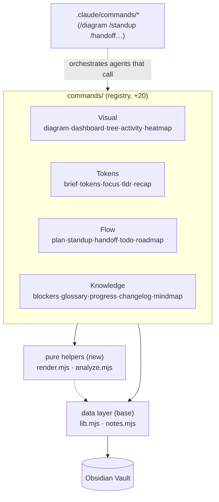
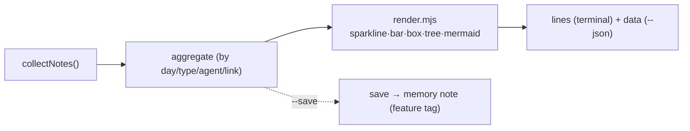
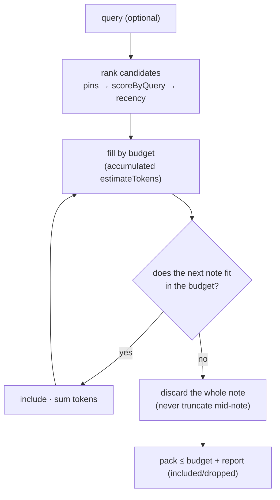
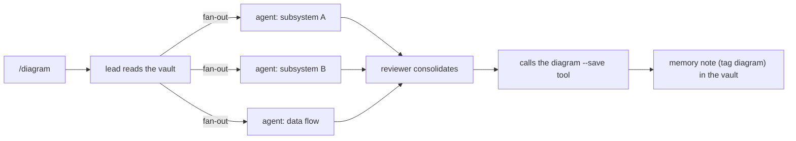

# AgentTeam-Memory — Architecture (Phase 3)

> Reference document for **Phase 3**: the vault starts to **work for the dev doing vibe coding via the
> terminal** — it distills memory into cheap context packages (more agent output without more tokens),
> **visualizes the system** (Mermaid, dashboard, tree, sparkline, heatmap), and delivers **daily-flow
> commands** (plan, standup, handoff, recap, todo, roadmap…).
> Status: **planned** — extends the base of **34 commands + statusline** (Phases 0/1/2) with **20 new
> tools** (F21–F40) → **54 commands + statusline**, under the same invariants (zero-dep, pure data layer,
> addition without central editing). Source of truth for the features:
> [`USER-STORIES-PHASE-3.md`](./USER-STORIES-PHASE-3.md). Base preserved:
> [`ARCHITECTURE.md`](./ARCHITECTURE.md) · [`ARCHITECTURE-PHASE-2.md`](./ARCHITECTURE-PHASE-2.md).

---

## 1. Overview and invariants

Phase 3 **adds, it does not rewrite**. Each new tool is a `commands/<name>.mjs` file that exports the
canonical contract `{ name, summary, usage, run(ctx) }` and returns `{ ok, code?, lines?, data? }`,
auto-discovered by `loadCommands()`. **All** the principles of the previous phases still hold:

1. **Zero dependencies.** Only `node:*` builtins.
2. **Pure data layer.** `lib.mjs`/`notes.mjs` (and now `render.mjs`/`analyze.mjs`) never print nor
   `exit`; console I/O belongs only to the dispatcher/commands.
3. **Addition without central editing.** The registry resolves each new file. None of the 34 tools + statusline
   changes its contract.
4. **Non-destructive by default.** Commands only write with `--save`/`--apply`/an explicit subcommand
   (`todo check`). Mutations rewrite via `formatNote` preserving unknown frontmatter.
5. **Cross-cutting `--json`** in every read tool, emitting only `res.data`.
6. **Fail-loud in the CLI.** Nonexistent/ambiguous `<ref>`, invalid usage → a clear error, `exit ≠ 0`.

The theme of the phase has three axes, each a cluster of tools:



### What does NOT change (regression forbidden)

The 34 base tools + `statusline.mjs` keep their signature, output, and `--json`. `render.mjs`/`analyze.mjs`
are **added**; `statusline.mjs` is **not** rewritten to use them (it avoids the risk of regression in the
Phase 2 flagship feature) — they coexist. `list`/`recent`/`search` keep the `pinned`-first ordering
introduced in Phase 2.

---

## 2. Shared modules (US-069) — what keeps the 20 commands thin

Two new pure modules absorb the repeated logic. Both **without** `console`/`process.exit`, 100%
testable in isolation (mirroring `lib.mjs`/`notes.mjs`).

### 2.1 `render.mjs` — presentation primitives

| Function | Responsibility |
| --- | --- |
| `useColor()` / `paint`/`dim`/`green`/`yellow`/`red`/`cyan` | ANSI colors; degrade to plain text under `NO_COLOR`/`TERM=dumb` (same rule as the statusline). |
| `bar(pct, width)` | Textual bar `[█████░░░░░]` clamped to [0,100]. |
| `sparkline(values)` | Series → `▁▂▃▄▅▆▇█` normalized to the max (max 0 ⇒ all `▁`, no division by zero). |
| `box(title, lines, opt)` | Box with borders (`┌─┐│└┘`), width computed from the content (not counting ANSI bytes). |
| `treeLines(root)` | Nested tree → lines with connectors `├─`/`└─`/`│`. |
| `heatGlyph(level)` / `quantize(values, n)` | Intensity glyph per level; `quantize` derives levels by **quartiles** of a series. |
| `mermaidEscape(s)` / `mermaidId(s)` | Sanitizes labels/ids for Mermaid: quotes, brackets, pipes, backticks, and breaks become safe text; stable id `n_<hash>`. |
| `truncate(s, n)` | Cuts text with `…`, preserving width (used by tree/dashboard/recap). |

> **Why centralize the Mermaid sanitization:** three tools emit Mermaid (`diagram`, `mindmap`, and the
> `--save` of `roadmap`/`changelog` which embeds blocks). A label with `[`/`]`/`"`/`|` silently breaks the
> Mermaid parser; a single tested `mermaidEscape` eliminates the entire class of bug.

### 2.2 `analyze.mjs` — text analysis (no LLM)

| Function | Responsibility |
| --- | --- |
| `STOPWORDS` | PT+EN union (reuses the `relate` list, now central). |
| `tokenize(text)` | Lowercase words, no stopwords, len ≥ 3. |
| `estimateTokens(text)` | Deterministic and **monotonic** heuristic: `round(chars/4)` adjusted by word count; same input ⇒ same number; larger text ⇒ tokens ≥. |
| `extractiveSummary(text, n, hints)` | Top-N sentences by weight (term freq + 1st-sentence bonus + title-term bonus); no body ⇒ uses the FM `summary`. |
| `scoreByQuery(note, query)` | Relevance score note↔query: tags (weight 3) > summary terms (2) > title/body terms (1). Reuses the `relate`/F20 idea, generalized to a free-form query. |

> **Token economy is local.** `estimateTokens`/`scoreByQuery`/`extractiveSummary` run **on the machine**,
> not on the LLM. `brief`/`focus`/`recap`/`tldr` use this to hand the agent an already-distilled package —
> the agent produces more with less context loaded. It is the technical translation of "more output, same tokens".

---

## 3. Visual cluster (F21–F25)

They all read the data layer and render via `render.mjs`. They mutate only with `--save` (a `memory` note with
the feature's tag).

- **`diagram` (F21, ⭐).** `--scope links|tags|agents|types`. `links`: nodes = notes, edges =
  `wikilinksOf` whose target exists in the scope (no phantom node). `tags/agents/types`: a bipartite graph
  note↔dimension. Emits ` ```mermaid ` `flowchart LR` with ids via `mermaidId` and labels via
  `mermaidEscape`. `--json`: `{ scope, nodes, edges }`. Empty vault ⇒ a placeholder node (valid Mermaid).
- **`dashboard` (F22).** Aggregates `byType`/`byAgent` (histograms), `recent`, `pins` (via `isPinned`),
  `orphans` (no `wikilinksOf`). Renders in a `box` with a mini-`bar`. `--json` with the complete object.
- **`tree` (F23).** Builds `project → type → note` (or `--by agent`), renders with `treeLines`; a glyph
  per type; leaf = `name` + `truncate(summary)`. `--depth`, `--all`, `--json` (nested tree).
- **`activity` (F24).** Counts `created` per day in the window (`--days`), `sparkline` + total/average/peak.
  `--by agent|type` ⇒ one sparkline per dimension. `--json`: `{ days, total, max, series }`.
- **`heatmap` (F25).** A weeks×7-days grid (`--weeks`), `quantize` by quartiles ⇒ `heatGlyph`. "Today"
  injectable (`opt.today`/ctx) for deterministic testing. `--json`: `{ weeks, cells }`.



---

## 4. Tokens cluster (F26–F30) — the heart of the economy

They reuse `analyze.mjs`. The common pattern of the budgeted selectors (`brief`, `focus`):



- **`brief` (F26).** Selection: pins → relevance(query) → recency; each note = `title — summary`
  (`--full` includes the body). Stops at the budget (`--budget`, default config/1500). `--json`:
  `{ budget, usedTokens, notes, dropped }`. **Invariant:** never exceeds the budget — a note that does not
  fit is discarded entirely.
- **`tokens` (F27).** `tokens <ref>` / the project's aggregate / `--text "..."`. `estimateTokens`. Output per
  note + total/average/top-N. Nonexistent `<ref>` ⇒ exit 1.
- **`focus` (F28).** `scoreByQuery` + fill by budget; `--top` and `--budget` compose. `--json`:
  `[{ name, score, tokens }]`. Empty query ⇒ exit 1.
- **`tldr` (F29).** `extractiveSummary` (`--sentences`, default 3). One note or a set. Falls back to
  the FM `summary` when there is no body.
- **`recap` (F30).** Window (`--since`), dense bullets per type, `--max` (default 12), prioritizes
  `decision`/`state` over `communication`; reports what was left out.

---

## 5. Flow cluster (F31–F35)

- **`plan` (F31).** Creates a `memory` note (tag `plan`) with fixed sections; `--steps "a;b;c"` ⇒ checkboxes
  `- [ ]`. Reuses the writing/naming of `save` (extracted into a shared "create note from
  body" helper, if needed, without altering `save`). `--json`: `{ name, path, steps }`.
- **`standup` (F32).** The window's notes grouped by agent: deliveries, count, last `state`.
  `--json`: `[{ agent, count, items, lastState }]`.
- **`handoff` (F33).** States per agent + open checkboxes (reuses the `todo` extractor) + pins +
  recent decisions ⇒ cohesive markdown. `--save` (tag `handoff`), `--json`.
- **`todo` (F34).** Extracts `- [ ]`/`- [x]` from the body of the notes (a robust regex, a single extractor,
  shared with `handoff`/`progress`). `todo check <ref> "<text>"` toggles 1 item (unique match;
  ambiguous ⇒ exit 1) rewriting via `formatNote`. `--json`: `{ open, done, items }`.
- **`roadmap` (F35).** `decision` (+`--include learning`) per month `YYYY-MM`; markdown + `--save`/`--json`.

> **A single checkbox extractor.** `todo`, `handoff`, and `progress` depend on "finding checkboxes in the
> body". A single `extractCheckboxes(body)` in `analyze.mjs` avoids three divergent regexes — the classic
> source of bug ("todo counts 4, progress counts 3").

---

## 6. Knowledge cluster (F36–F40)

- **`blockers` (F36).** Risk tags (`blocker`/`risk`/`blocked`) **or** markers in the body
  (`blocked`/`risco`/`⚠`), case-insensitive. `--json`: `[{ name, reason, source }]`.
- **`glossary` (F37).** `tokenize` over summaries/titles, freq ≥ `--min` (default 2), term →
  source notes. `--json`: `[{ term, count, notes }]`.
- **`progress` (F38).** Checkboxes `done/total` (% + `bar`), complete plans, open blockers.
  `--json` with the three blocks. No data ⇒ zeros with no division by zero.
- **`changelog` (F39).** `decision`/`learning` by date desc, type badge. `--since`/`--save`/`--json`.
- **`mindmap` (F40).** Root = a note (`<ref>`) or a tag (`--tag`); branches = wikilinks (1st level) + notes with
  tags in common; `--depth`. Emits ` ```mermaid ` `mindmap` sanitized. Nonexistent `<ref>` ⇒ exit 1.

---

## 7. Orchestration layer — slash-commands (US-068)

`.claude/commands/<name>.md` files that are **not** registry tools: they are prompts that instruct the
lead/teammates of the memory-team. The anchor case is `/diagram`:



`/diagram` and `/mindmap` do a **fan-out** (multiple agents architect by subsystem, the reviewer
consolidates, the `diagram`/`mindmap` engine materializes the Mermaid and saves it). `/standup`, `/handoff`,
`/recap`, `/plan` are direct wrappers of the eponymous tools. They all respect the output discipline of the
protocol (the result + where the note landed). They are validated **by inspection** (a prompt layer), not by
unit test — the testable logic lives in the tools they call.

---

## 8. Tests (US-070)

Mirrors the previous phases: native **`node:test`**, **no mocks**, a temporary vault per test under
`os.tmpdir()` via `test/_helpers.mjs` (`makeVault`/`seedNote`/`run`/`runCli`/`cleanup`). Each one of the
20 tools ⇒ **one `test/<name>.test.mjs` file with ≥ 5 tests**; aggregate goal **≥ 100 new tests**.

Pattern per tool:

- **happy path in-process** (`run`) with asserts on `res.ok`/`res.data`;
- **edge branches**: empty vault, nonexistent/ambiguous `<ref>`, missing flags, `--json` (only `data`);
- **mutating tools** (`plan`, `todo check`, `*/--save`): round-trip of unknown frontmatter via
  `formatNote` (US-030 invariant);
- **tools with Mermaid** (`diagram`, `mindmap`): validate ` ```mermaid ` is present, ids/labels
  sanitized, and that a malicious label (`a]b"c|d`) does not leak a character that breaks the parser;
- **budgeted tools** (`brief`, `focus`): assert that `usedTokens ≤ budget` and that the note that does not fit
  is discarded entirely;
- **determinism**: `activity`/`heatmap`/`recap` receive an injected "today"/window — without depending on the
  real clock;
- **helpers** (`render.mjs`/`analyze.mjs`): direct tests (sparkline normalizes, `estimateTokens`
  monotonic, `mermaidEscape` neutralizes, colors degrade under `NO_COLOR`).

**Final validation (project gate):** `npm test` runs in full and green; an **inventory regression** test
checks that (a) the 54 tools are registered and (b) the 34 base ones keep `summary`/`usage`.
This proves the requirement "everything new was added **and** the logic that existed before still exists".

---

## 9. Delivery plan by phases (commit + push per phase)

| Phase | Content | Commit |
| --- | --- | --- |
| 3.0 | Branch + `USER-STORIES-PHASE-3.md` + `ARCHITECTURE-PHASE-3.md` | `docs: specify Phase 3 (US + architecture)` |
| 3.1 | `render.mjs` + `analyze.mjs` + helper tests | `feat: shared render/analyze helpers + tests` |
| 3.2 | Visual cluster (F21–F25) + tests | `feat: visual cluster — diagram·dashboard·tree·activity·heatmap` |
| 3.3 | Tokens cluster (F26–F30) + tests | `feat: tokens cluster — brief·tokens·focus·tldr·recap` |
| 3.4 | Flow cluster (F31–F35) + tests | `feat: flow cluster — plan·standup·handoff·todo·roadmap` |
| 3.5 | Knowledge cluster (F36–F40) + tests | `feat: knowledge cluster — blockers·glossary·progress·changelog·mindmap` |
| 3.6 | Slash-commands + inventory/regression test + final validation | `feat: orchestration slash-commands + Phase 3 validation` |

Each phase: implement → `npm test` green → `git commit` → `git push` on the branch
`feature/phase-3-dx-and-20-tools`.
