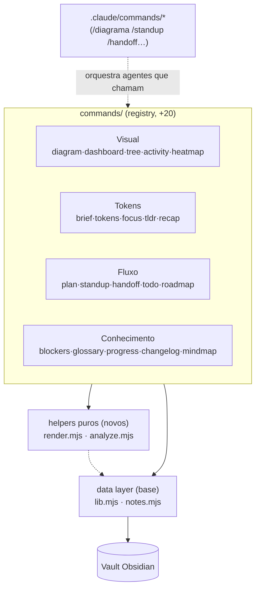
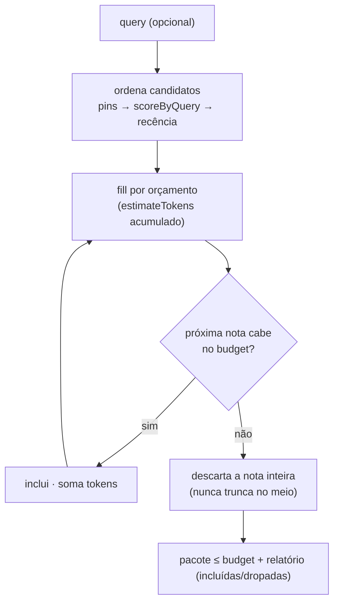
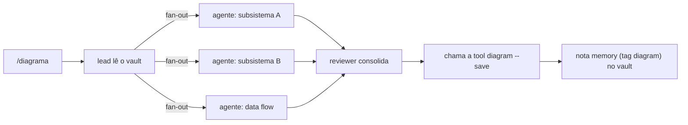

# AgentTeam-Memory — Arquitetura (Fase 3)

> Documento de referência da **Fase 3**: o vault passa a **trabalhar pelo dev que faz vibe coding via
> terminal** — destila memória em pacotes baratos de contexto (mais output do agente sem mais tokens),
> **visualiza o sistema** (Mermaid, painel, árvore, sparkline, heatmap) e entrega **comandos de fluxo
> diário** (plan, standup, handoff, recap, todo, roadmap…).
> Estado: **planejada** — estende a base de **34 comandos + statusline** (Fases 0/1/2) com **20 tools
> novas** (F21–F40) → **54 comandos + statusline**, sob os mesmos invariantes (zero-dep, data layer
> puro, adição sem edição central). Fonte da verdade das features:
> [`USER-STORIES-PHASE-3.md`](./USER-STORIES-PHASE-3.md). Base preservada:
> [`ARCHITECTURE.md`](./ARCHITECTURE.md) · [`ARCHITECTURE-PHASE-2.md`](./ARCHITECTURE-PHASE-2.md).

---

## 1. Visão geral e invariantes

A Fase 3 **adiciona, não reescreve**. Cada tool nova é um arquivo `commands/<nome>.mjs` que exporta o
contrato canônico `{ name, summary, usage, run(ctx) }` e devolve `{ ok, code?, lines?, data? }`,
auto-descoberto por `loadCommands()`. Continuam valendo **todos** os princípios das fases anteriores:

1. **Zero dependências.** Só `node:*` builtins.
2. **Data layer puro.** `lib.mjs`/`notes.mjs` (e agora `render.mjs`/`analyze.mjs`) nunca imprimem nem
   dão `exit`; o I/O de console é só do dispatcher/comandos.
3. **Adição sem edição central.** Registry resolve cada arquivo novo. Nenhuma das 34 tools + statusline
   muda de contrato.
4. **Não-destrutivo por padrão.** Comandos só escrevem com `--save`/`--apply`/subcomando explícito
   (`todo check`). Mutações reescrevem via `formatNote` preservando frontmatter desconhecido.
5. **`--json` transversal** em toda tool de leitura, emitindo só `res.data`.
6. **Fail-loud no CLI.** `<ref>` inexistente/ambíguo, uso inválido → erro claro, `exit ≠ 0`.

O tema da fase tem três eixos, cada um um cluster de tools:



### O que NÃO muda (regressão proibida)

As 34 tools da base + `statusline.mjs` mantêm assinatura, saída e `--json`. `render.mjs`/`analyze.mjs`
são **adicionados**; o `statusline.mjs` **não** é reescrito para usá-los (evita risco de regressão na
feature-estrela da Fase 2) — convivem. `list`/`recent`/`search` continuam com a ordenação `pinned`
primeiro introduzida na Fase 2.

---

## 2. Módulos compartilhados (US-069) — o que mantém os 20 comandos finos

Dois módulos puros novos absorvem a lógica repetida. Ambos **sem** `console`/`process.exit`, 100%
testáveis em isolamento (espelham `lib.mjs`/`notes.mjs`).

### 2.1 `render.mjs` — primitivas de apresentação

| Função | Responsabilidade |
| --- | --- |
| `useColor()` / `paint`/`dim`/`green`/`yellow`/`red`/`cyan` | Cores ANSI; degradam para texto puro sob `NO_COLOR`/`TERM=dumb` (mesma regra do statusline). |
| `bar(pct, width)` | Barra textual `[█████░░░░░]` clampada a [0,100]. |
| `sparkline(values)` | Série → `▁▂▃▄▅▆▇█` normalizado ao max (max 0 ⇒ tudo `▁`, sem divisão por zero). |
| `box(title, lines, opt)` | Caixa com bordas (`┌─┐│└┘`), largura calculada a partir do conteúdo (sem contar bytes ANSI). |
| `treeLines(root)` | Árvore aninhada → linhas com conectores `├─`/`└─`/`│`. |
| `heatGlyph(level)` / `quantize(values, n)` | Glyph de intensidade por nível; `quantize` deriva níveis por **quartis** de uma série. |
| `mermaidEscape(s)` / `mermaidId(s)` | Sanitiza rótulos/ids para Mermaid: aspas, colchetes, pipes, crases e quebras viram texto seguro; id estável `n_<hash>`. |
| `truncate(s, n)` | Corta texto com `…`, preservando largura (usado por tree/dashboard/recap). |

> **Por que centralizar a sanitização Mermaid:** três tools emitem Mermaid (`diagram`, `mindmap` e o
> `--save` de `roadmap`/`changelog` que embute blocos). Um rótulo com `[`/`]`/`"`/`|` quebra o parser do
> Mermaid silenciosamente; um único `mermaidEscape` testado elimina a classe inteira de bug.

### 2.2 `analyze.mjs` — análise de texto (sem LLM)

| Função | Responsabilidade |
| --- | --- |
| `STOPWORDS` | União PT+EN (reaproveita a lista do `relate`, agora central). |
| `tokenize(text)` | Palavras minúsculas, sem stopwords, len ≥ 3. |
| `estimateTokens(text)` | Heurística determinística e **monotônica**: `round(chars/4)` ajustado por nº de palavras; mesmo input ⇒ mesmo número; texto maior ⇒ tokens ≥. |
| `extractiveSummary(text, n, hints)` | Top-N frases por peso (freq de termos + bônus 1ª frase + bônus termos do título); sem corpo ⇒ usa o `summary` do FM. |
| `scoreByQuery(note, query)` | Score de relevância nota↔query: tags (peso 3) > termos de summary (2) > termos de título/corpo (1). Reusa a ideia do `relate`/F20, generalizada para uma query livre. |

> **Token economy é local.** `estimateTokens`/`scoreByQuery`/`extractiveSummary` rodam **na máquina**,
> não no LLM. `brief`/`focus`/`recap`/`tldr` usam isso para entregar ao agente um pacote já destilado —
> o agente produz mais com menos contexto carregado. É a tradução técnica de "mais output, mesmos tokens".

---

## 3. Cluster Visual (F21–F25)

Todos leem o data layer e renderizam via `render.mjs`. Mutam só com `--save` (nota `memory` com a tag
da feature).

- **`diagram` (F21, ⭐).** `--scope links|tags|agents|types`. `links`: nós = notas, arestas =
  `wikilinksOf` cujo alvo existe no escopo (sem nó fantasma). `tags/agents/types`: grafo bipartido
  nota↔dimensão. Emite ` ```mermaid ` `flowchart LR` com ids via `mermaidId` e rótulos via
  `mermaidEscape`. `--json`: `{ scope, nodes, edges }`. Vault vazio ⇒ nó-placeholder (Mermaid válido).
- **`dashboard` (F22).** Agrega `byType`/`byAgent` (histogramas), `recent`, `pins` (via `isPinned`),
  `orphans` (sem `wikilinksOf`). Render em `box` com mini-`bar`. `--json` com o objeto completo.
- **`tree` (F23).** Monta `projeto → tipo → nota` (ou `--by agent`), renderiza com `treeLines`; glyph
  por tipo; folha = `nome` + `truncate(summary)`. `--depth`, `--all`, `--json` (árvore aninhada).
- **`activity` (F24).** Conta `created` por dia na janela (`--days`), `sparkline` + total/média/pico.
  `--by agent|type` ⇒ uma sparkline por dimensão. `--json`: `{ days, total, max, series }`.
- **`heatmap` (F25).** Grade semanas×7 dias (`--weeks`), `quantize` por quartis ⇒ `heatGlyph`. "Hoje"
  injetável (`opt.today`/ctx) para teste determinístico. `--json`: `{ weeks, cells }`.


---

## 4. Cluster Tokens (F26–F30) — o coração da economia

Reusam `analyze.mjs`. O padrão comum dos seletores budgetados (`brief`, `focus`):



- **`brief` (F26).** Seleção pins → relevância(query) → recência; cada nota = `título — summary`
  (`--full` inclui corpo). Para no orçamento (`--budget`, default config/1500). `--json`:
  `{ budget, usedTokens, notes, dropped }`. **Invariante:** nunca ultrapassa o budget — a nota que não
  cabe é descartada por inteiro.
- **`tokens` (F27).** `tokens <ref>` / agregado do projeto / `--text "..."`. `estimateTokens`. Saída por
  nota + total/média/top-N. `<ref>` inexistente ⇒ exit 1.
- **`focus` (F28).** `scoreByQuery` + fill por orçamento; `--top` e `--budget` compõem. `--json`:
  `[{ name, score, tokens }]`. Query vazia ⇒ exit 1.
- **`tldr` (F29).** `extractiveSummary` (`--sentences`, default 3). Uma nota ou conjunto. Fallback ao
  `summary` do FM quando não há corpo.
- **`recap` (F30).** Janela (`--since`), bullets densos por tipo, `--max` (default 12), prioriza
  `decision`/`state` sobre `communication`; reporta o que ficou de fora.

---

## 5. Cluster Fluxo (F31–F35)

- **`plan` (F31).** Cria nota `memory` (tag `plan`) com seções fixas; `--steps "a;b;c"` ⇒ checkboxes
  `- [ ]`. Reusa a escrita/naming do `save` (extraída para um helper compartilhado de "criar nota a
  partir de corpo", se necessário, sem alterar o `save`). `--json`: `{ name, path, steps }`.
- **`standup` (F32).** Notas da janela agrupadas por agente: entregas, contagem, último `state`.
  `--json`: `[{ agent, count, items, lastState }]`.
- **`handoff` (F33).** Estados por agente + checkboxes abertos (reusa o extrator do `todo`) + pins +
  decisões recentes ⇒ markdown coeso. `--save` (tag `handoff`), `--json`.
- **`todo` (F34).** Extrai `- [ ]`/`- [x]` do corpo das notas (regex robusto, único extrator,
  compartilhado com `handoff`/`progress`). `todo check <ref> "<texto>"` alterna 1 item (match único;
  ambíguo ⇒ exit 1) reescrevendo via `formatNote`. `--json`: `{ open, done, items }`.
- **`roadmap` (F35).** `decision` (+`--include learning`) por mês `YYYY-MM`; markdown + `--save`/`--json`.

> **Extrator de checkbox único.** `todo`, `handoff` e `progress` dependem de "achar checkboxes no
> corpo". Um só `extractCheckboxes(body)` em `analyze.mjs` evita três regexes divergentes — a fonte
> clássica de bug ("o todo conta 4, o progress conta 3").

---

## 6. Cluster Conhecimento (F36–F40)

- **`blockers` (F36).** Tags de risco (`blocker`/`risk`/`blocked`) **ou** marcadores no corpo
  (`blocked`/`risco`/`⚠`), case-insensitive. `--json`: `[{ name, reason, source }]`.
- **`glossary` (F37).** `tokenize` sobre summaries/títulos, freq ≥ `--min` (default 2), termo →
  notas-fonte. `--json`: `[{ term, count, notes }]`.
- **`progress` (F38).** Checkboxes `done/total` (% + `bar`), planos completos, bloqueios abertos.
  `--json` com os três blocos. Sem dados ⇒ zeros sem divisão por zero.
- **`changelog` (F39).** `decision`/`learning` por data desc, badge de tipo. `--since`/`--save`/`--json`.
- **`mindmap` (F40).** Raiz = nota (`<ref>`) ou tag (`--tag`); ramos = wikilinks (1º nível) + notas com
  tags em comum; `--depth`. Emite ` ```mermaid ` `mindmap` sanitizado. `<ref>` inexistente ⇒ exit 1.

---

## 7. Camada de orquestração — slash-commands (US-068)

Arquivos `.claude/commands/<nome>.md` que **não** são tools do registry: são prompts que instruem o
lead/teammates da memory-team. O caso-âncora é `/diagrama`:



`/diagrama` e `/mindmap` fazem **fan-out** (múltiplos agentes arquitetam por subsistema, o reviewer
consolida, o engine `diagram`/`mindmap` materializa o Mermaid e salva). `/standup`, `/handoff`,
`/recap`, `/plano` são wrappers diretos das tools homônimas. Todos respeitam a disciplina de output do
protocolo (resultado + onde a nota caiu). São validados **por inspeção** (camada de prompt), não por
unit test — a lógica testável vive nas tools que eles chamam.

---

## 8. Testes (US-070)

Espelha as fases anteriores: **`node:test`** nativo, **sem mocks**, vault temporário por teste sob
`os.tmpdir()` via `test/_helpers.mjs` (`makeVault`/`seedNote`/`run`/`runCli`/`cleanup`). Cada uma das
20 tools ⇒ **um arquivo `test/<nome>.test.mjs` com ≥ 5 testes**; meta agregada **≥ 100 testes novos**.

Padrão por tool:

- **happy path in-process** (`run`) com asserts em `res.ok`/`res.data`;
- **ramos de borda**: vault vazio, `<ref>` inexistente/ambíguo, flags ausentes, `--json` (só `data`);
- **tools que mutam** (`plan`, `todo check`, `*/--save`): round-trip de frontmatter desconhecido via
  `formatNote` (invariante US-030);
- **tools com Mermaid** (`diagram`, `mindmap`): valida `` ```mermaid `` presente, ids/labels
  sanitizados, e que rótulo malicioso (`a]b"c|d`) não vaza caractere que quebra o parser;
- **tools budgetadas** (`brief`, `focus`): asserta que `usedTokens ≤ budget` e que a nota que não cabe
  é descartada inteira;
- **determinismo**: `activity`/`heatmap`/`recap` recebem "hoje"/janela injetados — sem depender do
  relógio real;
- **helpers** (`render.mjs`/`analyze.mjs`): testes diretos (sparkline normaliza, `estimateTokens`
  monotônico, `mermaidEscape` neutraliza, cores degradam sob `NO_COLOR`).

**Validação final (gate do projeto):** `npm test` roda inteiro e verde; um teste de **regressão de
inventário** confere que (a) as 54 tools estão registradas e (b) as 34 da base mantêm `summary`/`usage`.
Isso prova o pedido "tudo de novo foi adicionado **e** a lógica que já existia antes ainda existe".

---

## 9. Plano de entrega por fases (commit + push por fase)

| Fase | Conteúdo | Commit |
| --- | --- | --- |
| 3.0 | Branch + `USER-STORIES-PHASE-3.md` + `ARCHITECTURE-PHASE-3.md` | `docs: especifica Fase 3 (US + arquitetura)` |
| 3.1 | `render.mjs` + `analyze.mjs` + testes dos helpers | `feat: helpers compartilhados render/analyze + testes` |
| 3.2 | Cluster Visual (F21–F25) + testes | `feat: cluster visual — diagram·dashboard·tree·activity·heatmap` |
| 3.3 | Cluster Tokens (F26–F30) + testes | `feat: cluster tokens — brief·tokens·focus·tldr·recap` |
| 3.4 | Cluster Fluxo (F31–F35) + testes | `feat: cluster fluxo — plan·standup·handoff·todo·roadmap` |
| 3.5 | Cluster Conhecimento (F36–F40) + testes | `feat: cluster conhecimento — blockers·glossary·progress·changelog·mindmap` |
| 3.6 | Slash-commands + teste de inventário/regressão + validação final | `feat: slash-commands de orquestração + validação Fase 3` |

Cada fase: implementar → `npm test` verde → `git commit` → `git push` na branch
`feature/phase-3-dx-and-20-tools`.
