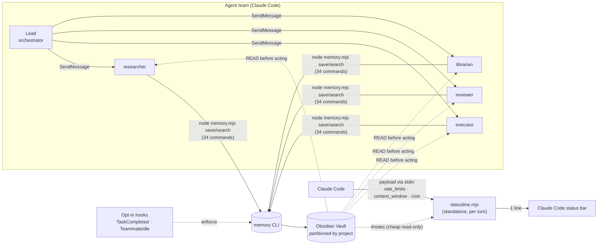
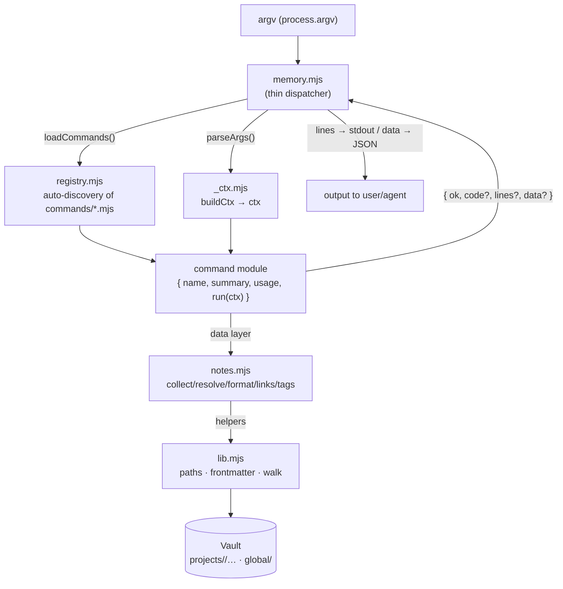
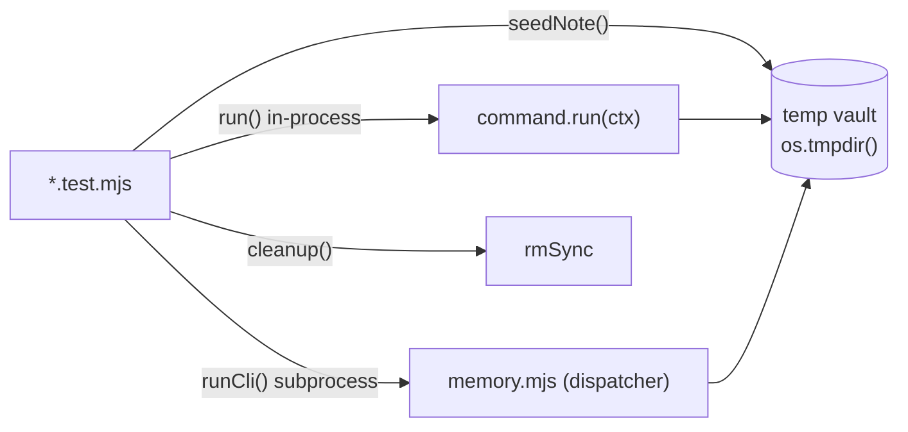

# AgentTeam-Memory — Architecture

> Architecture reference document for the `memory-team` memory CLI.
> Status: **Phase 2 delivered** — +10 features (F11–F20), +9 registry tools + 1 standalone
> statusline on top of the 25 base commands → **34 commands + statusline**; suite **232/232** (was 100/100).
> The base (Phase 0/1) totaled 25 commands / suite 100/100.
> Phase 2 breakdown: [`ARCHITECTURE-PHASE-2.md`](./ARCHITECTURE-PHASE-2.md) ·
> [`USER-STORIES-PHASE-2.md`](./USER-STORIES-PHASE-2.md).
> Source of truth for the code: `memory-team/{lib.mjs,notes.mjs,memory.mjs,statusline.mjs,commands/}`.

---

## 1. Product overview

`AgentTeam-Memory` is a **zero-dependency Node.js ESM CLI** that gives **persistent,
per-project, auditable memory** to Claude Code *agent teams*, writing into an **Obsidian vault**.

### The problem

Claude Code *agent teams* have two fundamental limitations:

1. **No shared memory** — each teammate has its own context; there is no common space
   where facts, decisions, and learnings survive outside the context window.
2. **No session resume** — when a teammate finishes, its context disappears. In a
   new session the team starts over from scratch.

The result is rework, re-litigated decisions, and knowledge lost between sessions.

### The solution

A central **Obsidian vault**, partitioned by project, is the only artifact that survives.
The CLI gives teammates a simple discipline: **READ memory before acting** and **WRITE
an atomic note after each delivery**. Notes are markdown with YAML frontmatter, linked
by `[[wikilinks]]`, navigable in Obsidian and versionable in git. Two opt-in hooks
(`TaskCompleted`, `TeammateIdle`) can **enforce** this discipline per project.



---

## 2. Runtime architecture

Phase 0 refactored the original monolith into a **modular command architecture**: a thin
dispatcher (`memory.mjs`) auto-discovers commands via a *registry*, each command is an
isolated module under `commands/`, and the vault-access logic lives in a *data layer* (`notes.mjs`)
on top of low-level helpers (`lib.mjs`). This eliminates merge conflicts between parallel
contributors (adding a tool = dropping a file) and makes each command testable in isolation.



### Flow of an invocation

1. `memory.mjs` loads all commands once (`loadCommands()`), runs `parseArgs(argv)`, and
   resolves the command name (the first positional).
2. No name, `help`, or `--help` → prints the auto-generated help from `usage`/`summary`.
3. Unknown name → error on stderr + help + `exit 1`.
4. Otherwise, it builds `ctx` with `buildCtx(...)` and calls `cmd.run(ctx)` (supports a
   synchronous return or a `Promise`).
5. Thrown exception → `error in "<cmd>": <msg>` on stderr + `exit 1` (fail-loud in the dispatcher).
6. Result rendering:
   - `--json` **and** `res.data !== undefined` → `JSON.stringify(res.data, null, 2)` on stdout;
   - otherwise, `res.lines.join('\n')` on stdout;
   - `res.code` (if truthy) becomes `process.exitCode`.

---

## 3. Layers

| Layer | File | Responsibility | Does not do |
| --- | --- | --- | --- |
| **Helpers** | `lib.mjs` | Resolves vault/project paths, partitions, `parseFM` (frontmatter), `walk`, `slug`, `today`, `getp`, `listProjects`, `isEnabled`. | Never reads argv nor prints. |
| **Data layer** | `notes.mjs` | Enumerate notes (`collectNotes`), resolve loose references (`resolveNotes`), reconstruct canonical text (`formatNote`), extract wikilinks (`wikilinksOf`), tag histogram (`tagHistogram`), `relOf`, `isArchived`. | Never calls `console.log`/`process.exit` — everything is unit-testable. |
| **Handlers** | `commands/*.mjs` | One command per file; implements `run(ctx)` and returns `{ ok, code?, lines?, data? }`. | Does not resolve env directly (uses `ctx.ROOT`/`ctx.PROJECT`). |
| **Context** | `commands/_ctx.mjs` | `parseArgs` (flag parser), `buildCtx` (injects `ROOT`/`PROJECT`, allows override in tests), `fail()` (uniform error). | — |
| **Registry** | `commands/registry.mjs` | Auto-discovery: imports every `*.mjs` in the folder except `_*` and `registry.mjs`; registers those that have `name` + `run`. | — |
| **Dispatcher** | `memory.mjs` | Argv parsing, help, dispatch, rendering of `lines`/`data`/`code`, error → exit mapping. | Does not know individual commands. |
| **Hooks** | `hooks/{task-completed,teammate-idle}.mjs` | Opt-in & fail-open enforcement via JSON stdin from Claude Code. | Does not block if the project has no `.memory-team`. |
| **Installer** | `install.mjs` | Promotes the runtime to `~/.claude`, merges `settings.json`, injects the protocol into `CLAUDE.md`, scaffolds the vault. Idempotent, non-destructive. | — |

### Vault and project resolution (`lib.mjs`)

- **Vault root**: `process.env.MEMORY_VAULT` → otherwise `DEFAULT_VAULT` (`~/.claude/memory-vault`).
- **Project**: `process.env.MEMORY_PROJECT` → otherwise `slug(basename(cwd))`.
- **Enabled**: a `.memory-team` exists at the project root → hooks enforce; otherwise fail-open.
- Paths normalized to forward-slash; `MEMORY_VAULT`/`MEMORY_PROJECT` are also the *injection
  points* used by the tests to point at a temporary vault.

---

## 4. Command contract

Every command is an ESM module with `export default`:

```js
export default {
  name: 'list',                          // unique identifier (registry key)
  summary: 'List/filter notes …',        // 1 line; shows up in help
  usage: 'list [--type t] [--tag x] …',  // signature; shows up in help (aligned)
  run(ctx) {
    // … reads from the data layer, builds the output …
    return { ok: true, lines: [...], data: [...] };
  },
};
```

### The `ctx`

```js
ctx = {
  ROOT,      // resolved vault root (string, forward-slash)
  PROJECT,   // detected/forced project (slug)
  pos,       // positionals AFTER the command name (string[])
  opt,       // flags: { key: value | true }  (--key value | --key)
  json,      // === (opt.json === true)
  all,       // === (opt.all === true)
}
```

> `parseArgs` treats `--key value` as a pair and `--key` (with no following value, or followed by another
> flag) as boolean `true`. Thus `--tag "a,b"` arrives as the string `"a,b"`; the command does the split.

### The return value

```js
{
  ok: boolean,       // logical success (not the exit code)
  code?: number,     // becomes process.exitCode if truthy (e.g.: validate → 1 with errors)
  lines?: string[],  // human output (default); the dispatcher does join('\n')
  data?: any,        // --json output (any JSON-serializable)
}
```

### `--json` mode (cross-cutting — F10)

When the user/agent passes `--json` **and** the command populates `data`, the dispatcher prints
**only** the JSON of `data` (without the `lines`). Read commands must always populate `data`
with the same information they show in `lines`, so that pipelines and Claude Code itself can
consume structured output. Write commands populate `data` with the result (e.g.,
`{ file, type, created }`).

### Error convention

Use `fail(message, code=1)` from `_ctx.mjs` for a uniform error result
(`{ ok:false, code, lines:[message], data:{error:message} }`), or return the shape manually
like the existing commands do for usage. **Thrown** errors (throw) are caught by the
dispatcher and become `exit 1` — use this only for unexpected failures, not for input validation.

---

## 5. Vault structure

```
<VAULT>/                                   # MEMORY_VAULT or ~/.claude/memory-vault
├── _index.md                              # master MOC (project list + count)
├── config.json                            # Phase 2 (F16) — central config; typed numbers
│                                          #   (e.g.: statusline warn/danger thresholds)
├── _templates/   <name>.md                # Phase 2 (F17) — vault note templates
├── _snapshots/   <timestamp>/             # Phase 2 (F19) — dated vault checkpoints
├── projects/
│   └── <project>/                         # slug(basename(cwd)) or MEMORY_PROJECT
│       ├── _index.md                      # project MOC (only the librarian regenerates it)
│       ├── memory/   YYYY-MM-DD-<slug>.md # memory | decision | learning (+ usage/digest tags, F12/F14)
│       ├── board/    YYYY-MM-DD-<from>-to-<to>.md   # communication
│       ├── agents/   <name>.md            # teammate state (survives the session)
│       ├── tasks/                         # (reserved for task artifacts)
│       ├── _snapshots/                    # Phase 2 (F19) — per-project checkpoints
│       └── _archive/                      # archived notes (F8) — out of searches by default
└── global/                                # cross-project knowledge
    ├── memory/
    └── board/
```

Phase 2 adds service artifacts **without** changing the existing structure:

- **`config.json`** lives at the **vault root** (not in a partition) — it is cross-project by nature
  (statusline thresholds, date format, custom context limit). It is not a note: `config set` writes it
  directly, without going through `formatNote`.
- **`_templates/`** (F17) holds the vault's note skeletons, in addition to those embedded in the code.
- **`_snapshots/`** (F19) holds dated checkpoints — a direct copy of the notes' bytes (without
  serializing via `export`), with recursion over `_snapshots` explicitly excluded.

Directories starting with `_` remain service directories: `collectNotes` walks only the known
bases (`memory/`, `board/`, `agents/`) and does **not** include `config.json`, `_templates/`, nor
`_snapshots/`. The `usage`/`digest` tag notes are normal `memory` notes (written by
`usage --save` / `digest --save`) — they appear in searches and in the graph, distinguished only by the tag.

### Note types and destination (`save`)

| Type | Destination | Naming |
| --- | --- | --- |
| `memory` `decision` `learning` | `memory/` (or `global/memory` with `--global`) | `YYYY-MM-DD-<title-slug>.md` (suffix `-2`, `-3`… on collision) |
| `communication` | `board/` | `YYYY-MM-DD-<from>-to-<to>.md` |
| `state` | `agents/` (always per-project) | `<name-slug>.md` (idempotent: does not overwrite) |

### Frontmatter schema (canonical order — `FM_ORDER`)

```yaml
---
type: memory            # memory | decision | learning | communication | state
project: <auto>
agent: <name>
summary: "Short sentence for AI retrieval."
tags: [domain, subtopic]
related: ["[[other-note]]"]
task: <task-id>
created: YYYY-MM-DD
---
```

`formatNote(fm, body)` reconstructs the text in `FM_ORDER`; unknown keys go to the
end, sorted. `summary` is always quoted; `related` quotes each wikilink. This guarantees that
maintenance commands (retag, rename, move, archive) **rewrite** notes in a stable and
diffable way, without destroying fields they do not know about.

---

## 6. The 10 Features

| # | Feature | Tools | Status |
| --- | --- | --- | --- |
| **F1** | Extensible modular command architecture (registry auto-discovery) | — (infra: dispatcher + registry + `_ctx`) | ✅ Phase 0 |
| **F2** | Note navigation and reading | `list`, `show`, `recent` | ✅ delivered |
| **F3** | Tag taxonomy management | `tags`, `tag`, `retag` | ✅ delivered |
| **F4** | Knowledge graph (wikilinks) | `backlinks`, `links`, `graph`, `orphans` | ✅ delivered |
| **F5** | Vault analytics and reports | `stats`, `timeline` | ✅ delivered |
| **F6** | Vault validation / lint | `validate` | ✅ delivered |
| **F7** | Duplicate detection and cleanup | `dedupe`, `prune` | ✅ delivered |
| **F8** | Note lifecycle | `archive`, `move`, `rename` | ✅ delivered |
| **F9** | Backup and portability | `export`, `import` | ✅ delivered |
| **F10** | Structured JSON output mode (`--json` cross-cutting) | all read tools | ✅ delivered |

### F1 — Extensible modular architecture (delivered)

Thin dispatcher + registry with auto-discovery. Adding a capability = creating a
`commands/<name>.mjs` that exports the contract. No central editing → no merge conflict between
parallel agents. The basis of all expansion.

### F2 — Navigation and reading

Locate and read notes without opening Obsidian. `list` filters by `type/tag/agent/project/since/limit`
(and `--archived`); `show <ref>` resolves a loose reference and prints the note; `recent [n]` shows
the latest notes by creation/modification date. Leverages `collectNotes`/`resolveNotes` from the data
layer.

### F3 — Tag taxonomy

Keeps the tag vocabulary coherent. `tags` lists the histogram (`tagHistogram`); `tag <ref>`
adds/removes tags on a note (rewrites via `formatNote`); `retag <old> <new>` renames a tag
in bulk (`--all` = all projects). Avoids the entropy of synonym/typo tags.

### F4 — Knowledge graph

Explores the `[[wikilinks]]` mesh (`wikilinksOf` covers `related` + body). `links <ref>` =
outgoing (notes this one points to); `backlinks <ref>` = incoming (notes that point to this one); `graph`
generates a **Mermaid** diagram of the graph; `orphans` lists notes with no connection at all (neither
incoming nor outgoing) — candidates to link or archive.

### F5 — Analytics and reports

Vault metrics. `stats` aggregates counts by type/agent/project/tag, totals, and orphans
(`--all` = entire vault); `timeline` lists activity by date (`--since`, `--limit`),
useful for auditing what the team produced in a window.

### F6 — Validation / lint

`validate` checks integrity: required frontmatter (`type`/`summary`), valid `type`,
broken wikilinks (pointing to nonexistent notes), malformed tags. **Exit code 1** when
there are errors — plugs into CI/hook. `--all` validates all projects.

### F7 — Duplicates and cleanup

`dedupe` detects near-identical notes (same title/slug or equal summary) and reports groups;
`prune` finds noise (empty notes or still at the template placeholder) in **dry-run by default** —
with `--apply` it **archives** the candidates to `_archive/` (does not delete). Safety: nothing leaves
the searches without an explicit flag and nothing is destroyed (recoverable via `archive --restore`).

### F8 — Note lifecycle

`archive <ref>` moves the note to `_archive/` (and `--restore` brings it back), taking it out of searches
without losing it; `move <ref> <targetProject>` relocates between projects; `rename <ref> <new title>`
changes title + filename, rewriting the frontmatter. All preserve the content via
`formatNote`.

### F9 — Backup and portability

`export` serializes the vault (or a project) to JSON or a Markdown bundle (`--format`, `--out`,
`--all`); `import <file>` rehydrates the notes into a project (`--project`). Ensures memory is
portable between machines and versionable outside Obsidian.

### F10 — Structured JSON output (cross-cutting — started)

`--json` on any read command makes the dispatcher emit only `res.data`. Already implemented in the
dispatcher (Phase 0); the expansion requires that **every** read tool populate `data` consistently,
enabling programmatic consumption (CI, other agents, scripts).

### Phase 2 — F11 to F20

Real-time observability and native integration with Claude Code. Full breakdown (payload,
fallbacks, contracts) in [`ARCHITECTURE-PHASE-2.md`](./ARCHITECTURE-PHASE-2.md).

| # | Feature | Tool | In one sentence |
| --- | --- | --- | --- |
| **F11** ⭐ | Real-time plan/context/cost usage | `statusline.mjs` (standalone) | The Claude Code footer shows `plan · ctx · $ · mem` per turn. |
| **F12** | Usage/cost ledger | `usage` | Aggregates cost/tokens from transcripts by day and project. |
| **F13** | Live tail of the vault | `watch` | Prints each new note live via `fs.watch`. |
| **F14** | Session digest | `digest` | Markdown summary of the window, grouped by agent/type. |
| **F15** | Health check | `doctor` | Diagnoses vault, settings, hooks, and statusline. |
| **F16** | Central configuration | `config` | Reads/writes preferences in the vault's `config.json`. |
| **F17** | Note templates | `template` | Creates a note from a skeleton with placeholders. |
| **F18** | Pin / highlight | `pin` | Marks key notes so they sort first in searches. |
| **F19** | Snapshot / checkpoint | `snapshot` | Freezes and restores the vault by direct byte copy. |
| **F20** | Wikilink suggestion | `relate` | Ranks similar notes and densifies the graph with `--apply`. |

**F11 (the flagship feature)** is the only one that is **not** a registry command: `statusline.mjs` is a
**standalone entrypoint**. Claude Code delivers the session state as **JSON via stdin** on each
refresh, and the script emits **a single line** in the footer with the plan usage (`rate_limits` 5h/7d), the %
of the context window (`context_window`), and the session's USD cost (`cost.total_cost_usd`) — exactly
what `/usage` shows, now passive. It is standalone for three reasons: it runs on **every refresh** (it cannot
afford `loadCommands()` of ~34 modules per turn), it **needs stdin** (the commands' `ctx` does not
expose stdin), and it emits **1 line** (not the `{ lines, data }` shape of the registry). It degrades and **exits 0** on
any error, never bringing down the render.

---

## 7. The 34 Tools + statusline (canonical signatures)

> Convention: `<ref>` is a loose reference resolved by `resolveNotes` (exact basename →
> slug fragment → name/summary substring). Filter flags are optional and combinable.

| # | Tool | Signature | Feature |
| --- | --- | --- | --- |
| 1 | `list` | `list [--type t][--tag x][--agent a][--project p][--since YYYY-MM-DD][--limit n][--archived][--all][--json]` | F2 |
| 2 | `show` | `show <ref> [--json]` | F2 |
| 3 | `recent` | `recent [n] [--all] [--json]` | F2 |
| 4 | `tags` | `tags [--all] [--json]` | F3 |
| 5 | `tag` | `tag <ref> [--add "a,b"] [--remove "c,d"] [--json]` | F3 |
| 6 | `retag` | `retag <old> <new> [--all] [--json]` | F3 |
| 7 | `backlinks` | `backlinks <ref> [--all] [--json]` | F4 |
| 8 | `links` | `links <ref> [--all] [--json]` | F4 |
| 9 | `graph` | `graph [--all] [--json]`  (Mermaid output) | F4 |
| 10 | `orphans` | `orphans [--all] [--json]` | F4 |
| 11 | `stats` | `stats [--all] [--json]` | F5 |
| 12 | `timeline` | `timeline [--since YYYY-MM-DD] [--limit n] [--all] [--json]` | F5 |
| 13 | `validate` | `validate [--all] [--json]`  (exit 1 if there are errors) | F6 |
| 14 | `dedupe` | `dedupe [--all] [--json]` | F7 |
| 15 | `prune` | `prune [--apply] [--all] [--json]`  (dry-run by default) | F7 |
| 16 | `archive` | `archive <ref> [--restore]` | F8 |
| 17 | `move` | `move <ref> <targetProject>` | F8 |
| 18 | `rename` | `rename <ref> <new title>` | F8 |
| 19 | `export` | `export [--format json\|md] [--out file] [--all]` | F9 |
| 20 | `import` | `import <file> [--project p]` | F9 |

> Mutating tools (5, 6, 15, 16, 17, 18, 20) rewrite notes via `formatNote` to preserve
> unknown frontmatter. In case of an ambiguous `<ref>` (several matches) they report the ambiguity
> instead of guessing. `move` and `rename` also have an **anti-clobber guard**: if the destination name
> already belongs to another note, they abort with an error instead of overwriting (fix from the adversarial
> review, Phase 3 — it avoided silent data loss).

### The 9 Phase 2 tools (F12–F20) — complement

> Same canonical contract as the base (`{ name, summary, usage, run(ctx) }`), auto-discovered by the
> registry. Read tools populate `data` for the cross-cutting `--json` (F10); mutating ones
> rewrite via `formatNote`. Breakdown in [`ARCHITECTURE-PHASE-2.md`](./ARCHITECTURE-PHASE-2.md).

| # | Tool | Signature | Feature | Mutates? |
| --- | --- | --- | --- | --- |
| 26 | `usage` | `usage [--since YYYY-MM-DD] [--limit n] [--save] [--json]` | F12 | only with `--save` (note) |
| 27 | `watch` | `watch [--all]`  (continuous stream) | F13 | no |
| 28 | `digest` | `digest [--since YYYY-MM-DD] [--save] [--json]` | F14 | only with `--save` (note) |
| 29 | `doctor` | `doctor [--json]`  (exit 1 if any `✗`) | F15 | no |
| 30 | `config` | `config list \| get <k> \| set <k> <v> [--json]` | F16 | `set` → `config.json` |
| 31 | `template` | `template list \| template <name> "<title>" [--json]` | F17 | creates note |
| 32 | `pin` | `pin <ref> [--off] \| pin --list [--json]` | F18 | yes (frontmatter) |
| 33 | `snapshot` | `snapshot [--list] [--restore <id>] [--json]` | F19 | creates / `--restore` destructive |
| 34 | `relate` | `relate <ref> [--apply] [--json]` | F20 | only with `--apply` (`related`) |

> `watch` (continuous stream) is **outside** the `lines/data` contract — a documented exception, analogous to the
> statusline. `snapshot --restore` is destructive: it requires the explicit flag and takes a safety snapshot
> beforehand (non-destructive invariant). `usage`/`digest` are read-only by default and only persist a note with
> `--save`; `relate` only touches `related` with `--apply`.

### `statusline.mjs` — standalone entrypoint (F11, outside the registry)

| Entrypoint | Signature | Feature | Mutates? |
| --- | --- | --- | --- |
| ⭐ `statusline.mjs` | `statusline.mjs [--install \| --uninstall \| --demo]` | F11 | only `--install`/`--uninstall` (the `statusLine` block of `settings.json`) |

It is not a registry tool: it reads the Claude Code payload via **stdin** and emits **1 line** in the footer
(its own trigger, input, and output — see §6, section 2 of the Phase 2 doc). The install subcommands
perform a **non-destructive, idempotent merge** in `~/.claude/settings.json` (mirroring the base's `install.mjs`);
`--demo` runs the pipeline with an embedded sample payload, without needing Claude Code.

---

## 8. Tests

The suite uses native **`node:test`** (`node --test "memory-team/test/*.test.mjs"`, the
`npm test` script) — zero dependencies, consistent with the product. **No mocks**: each test creates a
temporary real vault under `os.tmpdir()` and exercises the real filesystem, just isolated.

### Utilities (`test/_helpers.mjs`)

| Helper | Use |
| --- | --- |
| `makeVault()` | Creates a temporary root (`mem-vault-…`), returns a forward-slash path. |
| `cleanup(root)` | Recursive `rmSync`, fail-safe. |
| `run(name, {pos,opt,root,project})` | Runs a command **in-process** with an injected `ctx` (fast; tests the logic). |
| `runCli(args, {root,project})` | Runs the **real CLI** as a subprocess via `MEMORY_VAULT`/`MEMORY_PROJECT` (e2e; tests the dispatcher + registry + render). |
| `seedNote(root, project, sub, file, fm, body)` | Seeds a note directly to disk, **bypassing** `save` — for read-side tests. |

### Coverage pattern per tool

Each new tool must have, at a minimum:

- **happy path in-process** (`run`) with asserts on `res.ok`/`res.data`;
- **e2e via `runCli`** when the behavior depends on the dispatcher (exit code, `--json`, render);
- **edge branches**: nonexistent `<ref>`, ambiguous `<ref>`, empty vault, missing flags;
- for **mutating** tools: an assert that unknown frontmatter survives the round-trip;
- for `validate`/`prune`: an assert of the **exit code** and of the **dry-run vs `--apply`** mode.



---

## 9. Design principles (invariants to maintain)

1. **Zero dependencies.** Only `node:*` builtins. Applies to tests too.
2. **Pure data layer.** `lib.mjs`/`notes.mjs` never print nor `exit` — only the commands and the
   dispatcher do console I/O.
3. **Isolated, testable commands.** Every external dependency enters via `ctx`; no reading
   `process.env` inside a `run`.
4. **Addition without central editing.** A new tool = a new file in `commands/`. The registry resolves it.
5. **Non-destructive by default.** Dangerous operations (`prune`) are dry-run until `--apply`;
   `archive` moves, does not delete.
6. **Stable round-trip.** Mutations rewrite via `formatNote` preserving unknown fields.
7. **Fail-open in hooks, fail-loud in the CLI.** Hooks never lock up the team over a bug; the CLI signals
   errors clearly.
8. **Real-time is cheap and fail-proof (Phase 2).** The live features (statusline, watch) run
   in a single pass and with no new dependency. The statusline consumes the ready-made payload (`rate_limits`,
   `context_window`, `cost`) and only touches the transcript in the fallback — and even then, it reads only the tail; it never
   uses `--all`.
9. **The statusline never brings down the Claude Code render (Phase 2).** Any error (empty stdin, invalid
   JSON, missing transcript, exception) degrades to a short fallback and **exits 0** — it never throws
   to Claude Code, never locks up. It is the one rule that overrides "fail-loud in the CLI" (principle 7),
   because it is on the UI's critical path.
