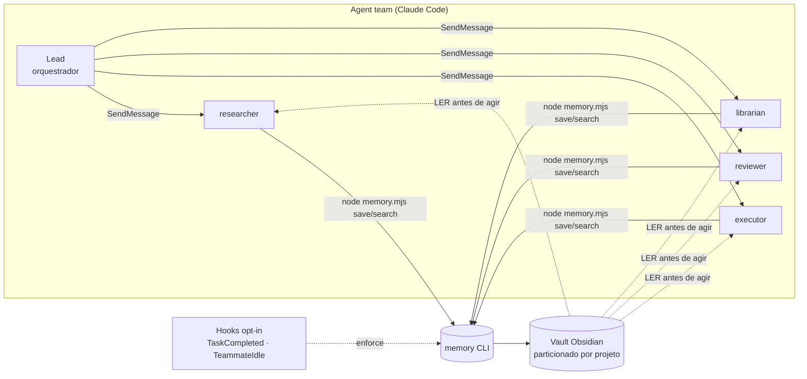

# AgentTeam-Memory — Arquitetura

> Documento de referência da arquitetura do CLI de memória do `memory-team`.
> Estado: **expansão entregue** — 10 features e 20 tools novas implementadas, testadas (suíte 100/100)
> e revisadas, sobre os 5 comandos base. Total: **25 comandos**.
> Fonte da verdade do código: `memory-team/{lib.mjs,notes.mjs,memory.mjs,commands/}`.

---

## 1. Visão geral do produto

`AgentTeam-Memory` é um **CLI Node.js ESM zero-dependency** que dá **memória persistente,
por-projeto e auditável** a *agent teams* do Claude Code, escrevendo num **vault Obsidian**.

### O problema

*Agent teams* do Claude Code têm duas limitações fundamentais:

1. **Sem memória compartilhada** — cada teammate tem o próprio contexto; não há um espaço
   comum onde fatos, decisões e aprendizados sobrevivam fora da janela de contexto.
2. **Sem session resume** — quando um teammate termina, o contexto dele desaparece. Numa
   nova sessão o time recomeça do zero.

O resultado é retrabalho, decisões re-litigadas e conhecimento perdido entre sessões.

### A solução

Um **vault Obsidian central**, particionado por projeto, é o único artefato que sobrevive.
O CLI dá aos teammates uma disciplina simples: **LER a memória antes de agir** e **ESCREVER
uma nota atômica depois de cada entrega**. As notas são markdown com frontmatter YAML, ligadas
por `[[wikilinks]]`, navegáveis no Obsidian e versionáveis no git. Dois hooks opt-in
(`TaskCompleted`, `TeammateIdle`) podem **forçar** essa disciplina por projeto.



---

## 2. Arquitetura de runtime

A Fase 0 refatorou o monólito original numa **arquitetura modular de comandos**: um dispatcher
fino (`memory.mjs`) descobre comandos automaticamente via um *registry*, cada comando é um módulo
isolado em `commands/`, e a lógica de acesso ao vault vive num *data layer* (`notes.mjs`) sobre
helpers de baixo nível (`lib.mjs`). Isso elimina conflitos de merge entre contribuidores paralelos
(adicionar uma tool = soltar um arquivo) e torna cada comando testável em isolamento.


### Fluxo de uma invocação

1. `memory.mjs` carrega todos os comandos uma vez (`loadCommands()`), faz `parseArgs(argv)` e
   resolve o nome do comando (o primeiro positional).
2. Sem nome, `help`, ou `--help` → imprime o help auto-gerado a partir de `usage`/`summary`.
3. Nome desconhecido → erro em stderr + help + `exit 1`.
4. Caso contrário, monta o `ctx` com `buildCtx(...)` e chama `cmd.run(ctx)` (suporta retorno
   síncrono ou `Promise`).
5. Exceção lançada → `error in "<cmd>": <msg>` em stderr + `exit 1` (fail-loud no dispatcher).
6. Render do resultado:
   - `--json` **e** `res.data !== undefined` → `JSON.stringify(res.data, null, 2)` no stdout;
   - senão, `res.lines.join('\n')` no stdout;
   - `res.code` (se truthy) vira `process.exitCode`.

---

## 3. Camadas

| Camada | Arquivo | Responsabilidade | Não faz |
| --- | --- | --- | --- |
| **Helpers** | `lib.mjs` | Resolução de paths do vault/projeto, partições, `parseFM` (frontmatter), `walk`, `slug`, `today`, `getp`, `listProjects`, `isEnabled`. | Nunca lê argv nem imprime. |
| **Data layer** | `notes.mjs` | Enumerar notas (`collectNotes`), resolver referência frouxa (`resolveNotes`), reconstruir texto canônico (`formatNote`), extrair wikilinks (`wikilinksOf`), histograma de tags (`tagHistogram`), `relOf`, `isArchived`. | Nunca chama `console.log`/`process.exit` — tudo é unit-testável. |
| **Handlers** | `commands/*.mjs` | Um comando por arquivo; implementa `run(ctx)` e devolve `{ ok, code?, lines?, data? }`. | Não resolve env diretamente (usa `ctx.ROOT`/`ctx.PROJECT`). |
| **Contexto** | `commands/_ctx.mjs` | `parseArgs` (flag parser), `buildCtx` (injeta `ROOT`/`PROJECT`, permite override em testes), `fail()` (erro uniforme). | — |
| **Registry** | `commands/registry.mjs` | Auto-discovery: importa todo `*.mjs` da pasta exceto `_*` e `registry.mjs`; registra os que têm `name` + `run`. | — |
| **Dispatcher** | `memory.mjs` | Parse de argv, help, despacho, render de `lines`/`data`/`code`, mapeamento de erro → exit. | Não conhece comandos individuais. |
| **Hooks** | `hooks/{task-completed,teammate-idle}.mjs` | Enforcement opt-in & fail-open via stdin JSON do Claude Code. | Não bloqueiam se o projeto não tem `.memory-team`. |
| **Instalador** | `install.mjs` | Promove o runtime para `~/.claude`, faz merge de `settings.json`, injeta o protocolo no `CLAUDE.md`, faz scaffold do vault. Idempotente, não-destrutivo. | — |

### Resolução de vault e projeto (`lib.mjs`)

- **Vault root**: `process.env.MEMORY_VAULT` → senão `DEFAULT_VAULT` (`~/.claude/memory-vault`).
- **Projeto**: `process.env.MEMORY_PROJECT` → senão `slug(basename(cwd))`.
- **Enabled**: existe `.memory-team` na raiz do projeto → hooks forçam; senão fail-open.
- Paths normalizados para forward-slash; `MEMORY_VAULT`/`MEMORY_PROJECT` são também os *pontos
  de injeção* usados pelos testes para apontar a um vault temporário.

---

## 4. Contrato de comando

Todo comando é um módulo ESM com `export default`:

```js
export default {
  name: 'list',                          // identificador único (chave do registry)
  summary: 'List/filter notes …',        // 1 linha; aparece no help
  usage: 'list [--type t] [--tag x] …',  // assinatura; aparece no help (alinhada)
  run(ctx) {
    // … lê do data layer, monta saída …
    return { ok: true, lines: [...], data: [...] };
  },
};
```

### O `ctx`

```js
ctx = {
  ROOT,      // vault root resolvido (string, forward-slash)
  PROJECT,   // projeto detectado/forçado (slug)
  pos,       // positionals APÓS o nome do comando (string[])
  opt,       // flags: { key: value | true }  (--key value | --key)
  json,      // === (opt.json === true)
  all,       // === (opt.all === true)
}
```

> `parseArgs` trata `--key value` como par e `--key` (sem valor seguinte, ou seguido de outra
> flag) como booleano `true`. Logo, `--tag "a,b"` chega como string `"a,b"`; o comando faz o split.

### O retorno

```js
{
  ok: boolean,       // sucesso lógico (não é o exit code)
  code?: number,     // vira process.exitCode se truthy (ex.: validate → 1 com erros)
  lines?: string[],  // saída humana (default); o dispatcher faz join('\n')
  data?: any,        // saída --json (qualquer JSON-serializável)
}
```

### Modo `--json` (transversal — F10)

Quando o usuário/agente passa `--json` **e** o comando popula `data`, o dispatcher imprime
**apenas** o JSON de `data` (sem as `lines`). Comandos de leitura devem sempre popular `data`
com a mesma informação que mostram em `lines`, para que pipelines e o próprio Claude Code possam
consumir saída estruturada. Comandos de escrita populam `data` com o resultado (ex.:
`{ file, type, created }`).

### Convenção de erro

Use `fail(message, code=1)` de `_ctx.mjs` para um resultado de erro uniforme
(`{ ok:false, code, lines:[message], data:{error:message} }`), ou retorne o shape manualmente
como os comandos existentes fazem para usage. Erros **lançados** (throw) são capturados pelo
dispatcher e viram `exit 1` — use isso só para falhas inesperadas, não para validação de input.

---

## 5. Estrutura do vault

```
<VAULT>/                                   # MEMORY_VAULT ou ~/.claude/memory-vault
├── _index.md                              # MOC mestre (lista projetos + contagem)
├── projects/
│   └── <project>/                         # slug(basename(cwd)) ou MEMORY_PROJECT
│       ├── _index.md                      # MOC do projeto (só o librarian regenera)
│       ├── memory/   YYYY-MM-DD-<slug>.md # memory | decision | learning
│       ├── board/    YYYY-MM-DD-<from>-to-<to>.md   # communication
│       ├── agents/   <name>.md            # state do teammate (sobrevive à sessão)
│       ├── tasks/                         # (reservado p/ artefatos de task)
│       └── _archive/                      # notas arquivadas (F8) — fora de buscas por padrão
└── global/                                # conhecimento cross-project
    ├── memory/
    └── board/
```

### Tipos de nota e destino (`save`)

| Tipo | Destino | Naming |
| --- | --- | --- |
| `memory` `decision` `learning` | `memory/` (ou `global/memory` com `--global`) | `YYYY-MM-DD-<slug-do-título>.md` (sufixo `-2`, `-3`… em colisão) |
| `communication` | `board/` | `YYYY-MM-DD-<from>-to-<to>.md` |
| `state` | `agents/` (sempre por-projeto) | `<slug-do-nome>.md` (idempotente: não sobrescreve) |

### Schema de frontmatter (ordem canônica — `FM_ORDER`)

```yaml
---
type: memory            # memory | decision | learning | communication | state
project: <auto>
agent: <name>
summary: "Frase curta para retrieval por IA."
tags: [domain, subtopic]
related: ["[[other-note]]"]
task: <task-id>
created: YYYY-MM-DD
---
```

`formatNote(fm, body)` reconstrói o texto na ordem de `FM_ORDER`; chaves desconhecidas vão para o
fim, ordenadas. `summary` é sempre aspeado; `related` aspeia cada wikilink. Isso garante que
comandos de manutenção (retag, rename, move, archive) **reescrevem** notas de forma estável e
diffável, sem destruir campos que não conhecem.

---

## 6. As 10 Features

| # | Feature | Tools | Status |
| --- | --- | --- | --- |
| **F1** | Arquitetura modular extensível de comandos (registry auto-discovery) | — (infra: dispatcher + registry + `_ctx`) | ✅ Fase 0 |
| **F2** | Navegação e leitura de notas | `list`, `show`, `recent` | ✅ entregue |
| **F3** | Gestão de taxonomia de tags | `tags`, `tag`, `retag` | ✅ entregue |
| **F4** | Grafo de conhecimento (wikilinks) | `backlinks`, `links`, `graph`, `orphans` | ✅ entregue |
| **F5** | Analytics e relatórios do vault | `stats`, `timeline` | ✅ entregue |
| **F6** | Validação / lint do vault | `validate` | ✅ entregue |
| **F7** | Detecção de duplicatas e limpeza | `dedupe`, `prune` | ✅ entregue |
| **F8** | Ciclo de vida de notas | `archive`, `move`, `rename` | ✅ entregue |
| **F9** | Backup e portabilidade | `export`, `import` | ✅ entregue |
| **F10** | Modo de saída estruturada JSON (`--json` transversal) | todas as tools de leitura | ✅ entregue |

### F1 — Arquitetura modular extensível (entregue)

Dispatcher fino + registry com auto-discovery. Adicionar uma capacidade = criar um
`commands/<nome>.mjs` que exporta o contrato. Sem edição central → sem conflito de merge entre
agentes paralelos. Base de toda a expansão.

### F2 — Navegação e leitura

Localizar e ler notas sem abrir o Obsidian. `list` filtra por `type/tag/agent/project/since/limit`
(e `--archived`); `show <ref>` resolve uma referência frouxa e imprime a nota; `recent [n]` mostra
as últimas notas por data de criação/modificação. Aproveita `collectNotes`/`resolveNotes` do data
layer.

### F3 — Taxonomia de tags

Mantém o vocabulário de tags coerente. `tags` lista o histograma (`tagHistogram`); `tag <ref>`
adiciona/remove tags numa nota (reescreve via `formatNote`); `retag <old> <new>` renomeia uma tag
em massa (`--all` = todos os projetos). Evita a entropia de tags sinônimas/typos.

### F4 — Grafo de conhecimento

Explora a malha de `[[wikilinks]]` (`wikilinksOf` cobre `related` + corpo). `links <ref>` =
saída (notas que esta aponta); `backlinks <ref>` = entrada (notas que apontam para esta); `graph`
gera um diagrama **Mermaid** do grafo; `orphans` lista notas sem nenhuma conexão (entrada nem
saída) — candidatas a ligar ou arquivar.

### F5 — Analytics e relatórios

Métricas do vault. `stats` agrega contagens por tipo/agente/projeto/tag, totais e órfãs
(`--all` = vault inteiro); `timeline` lista a atividade por data (`--since`, `--limit`),
útil para auditar o que o time produziu numa janela.

### F6 — Validação / lint

`validate` checa integridade: frontmatter obrigatório (`type`/`summary`), `type` válido,
wikilinks quebrados (apontando para notas inexistentes), tags malformadas. **Exit code 1** quando
há erros — pluga em CI/hook. `--all` valida todos os projetos.

### F7 — Duplicatas e limpeza

`dedupe` detecta notas quase-idênticas (mesmo título/slug ou summary igual) e reporta grupos;
`prune` acha ruído (notas vazias ou ainda no placeholder do template) em **dry-run por padrão** —
com `--apply` **arquiva** os candidatos para `_archive/` (não deleta). Segurança: nada sai das
buscas sem flag explícita e nada é destruído (recuperável via `archive --restore`).

### F8 — Ciclo de vida de notas

`archive <ref>` move a nota para `_archive/` (e `--restore` traz de volta), tirando-a das buscas
sem perdê-la; `move <ref> <targetProject>` reloca entre projetos; `rename <ref> <novo titulo>`
muda título + nome de arquivo, reescrevendo o frontmatter. Todos preservam o conteúdo via
`formatNote`.

### F9 — Backup e portabilidade

`export` serializa o vault (ou um projeto) para JSON ou um bundle Markdown (`--format`, `--out`,
`--all`); `import <file>` reidrata as notas num projeto (`--project`). Garante que a memória é
portável entre máquinas e versionável fora do Obsidian.

### F10 — Saída estruturada JSON (transversal — iniciada)

`--json` em qualquer comando de leitura faz o dispatcher emitir só `res.data`. Já implementado no
dispatcher (Fase 0); a expansão exige que **toda** tool de leitura popule `data` de forma
consistente, habilitando consumo programático (CI, outros agentes, scripts).

---

## 7. As 20 Tools (assinaturas canônicas)

> Convenção: `<ref>` é uma referência frouxa resolvida por `resolveNotes` (basename exato →
> fragmento de slug → substring de nome/summary). Flags de filtro são opcionais e combináveis.

| # | Tool | Assinatura | Feature |
| --- | --- | --- | --- |
| 1 | `list` | `list [--type t][--tag x][--agent a][--project p][--since YYYY-MM-DD][--limit n][--archived][--all][--json]` | F2 |
| 2 | `show` | `show <ref> [--json]` | F2 |
| 3 | `recent` | `recent [n] [--all] [--json]` | F2 |
| 4 | `tags` | `tags [--all] [--json]` | F3 |
| 5 | `tag` | `tag <ref> [--add "a,b"] [--remove "c,d"] [--json]` | F3 |
| 6 | `retag` | `retag <old> <new> [--all] [--json]` | F3 |
| 7 | `backlinks` | `backlinks <ref> [--all] [--json]` | F4 |
| 8 | `links` | `links <ref> [--all] [--json]` | F4 |
| 9 | `graph` | `graph [--all] [--json]`  (saída Mermaid) | F4 |
| 10 | `orphans` | `orphans [--all] [--json]` | F4 |
| 11 | `stats` | `stats [--all] [--json]` | F5 |
| 12 | `timeline` | `timeline [--since YYYY-MM-DD] [--limit n] [--all] [--json]` | F5 |
| 13 | `validate` | `validate [--all] [--json]`  (exit 1 se houver erros) | F6 |
| 14 | `dedupe` | `dedupe [--all] [--json]` | F7 |
| 15 | `prune` | `prune [--apply] [--all] [--json]`  (dry-run por padrão) | F7 |
| 16 | `archive` | `archive <ref> [--restore]` | F8 |
| 17 | `move` | `move <ref> <targetProject>` | F8 |
| 18 | `rename` | `rename <ref> <novo titulo>` | F8 |
| 19 | `export` | `export [--format json\|md] [--out file] [--all]` | F9 |
| 20 | `import` | `import <file> [--project p]` | F9 |

> Tools que mutam (5, 6, 15, 16, 17, 18, 20) reescrevem notas via `formatNote` para preservar
> frontmatter desconhecido. Em caso de `<ref>` ambíguo (vários matches) reportam a ambiguidade
> em vez de adivinhar. `move` e `rename` ainda têm **guarda anti-clobber**: se o nome de destino
> já pertence a outra nota, abortam com erro em vez de sobrescrever (correção da revisão adversarial,
> Fase 3 — evitava perda silenciosa de dados).

---

## 8. Testes

A suíte usa **`node:test`** nativo (`node --test "memory-team/test/*.test.mjs"`, script
`npm test`) — zero dependências, coerente com o produto. **Sem mocks**: cada teste cria um vault
temporário real sob `os.tmpdir()` e exercita o filesystem de verdade, só isolado.

### Utilitários (`test/_helpers.mjs`)

| Helper | Uso |
| --- | --- |
| `makeVault()` | Cria um root temporário (`mem-vault-…`), retorna path forward-slash. |
| `cleanup(root)` | `rmSync` recursivo, fail-safe. |
| `run(name, {pos,opt,root,project})` | Roda um comando **in-process** com `ctx` injetado (rápido; testa a lógica). |
| `runCli(args, {root,project})` | Roda o **CLI real** como subprocesso via `MEMORY_VAULT`/`MEMORY_PROJECT` (e2e; testa o dispatcher + registry + render). |
| `seedNote(root, project, sub, file, fm, body)` | Semeia uma nota direto no disco, **bypassando** `save` — para testes do lado de leitura. |

### Padrão de cobertura por tool

Cada tool nova deve ter, no mínimo:

- **happy path in-process** (`run`) com asserts em `res.ok`/`res.data`;
- **e2e via `runCli`** quando o comportamento depende do dispatcher (exit code, `--json`, render);
- **ramos de borda**: `<ref>` inexistente, `<ref>` ambíguo, vault vazio, flags ausentes;
- para tools que **mutam**: asserto de que o frontmatter desconhecido sobrevive ao round-trip;
- para `validate`/`prune`: asserto do **exit code** e do modo **dry-run vs `--apply`**.


---

## 9. Princípios de design (invariantes a manter)

1. **Zero dependências.** Só `node:*` builtins. Vale também para testes.
2. **Data layer puro.** `lib.mjs`/`notes.mjs` nunca imprimem nem dão `exit` — só os comandos e o
   dispatcher fazem I/O de console.
3. **Comandos isolados e testáveis.** Toda dependência externa entra pelo `ctx`; nada de ler
   `process.env` dentro de um `run`.
4. **Adição sem edição central.** Nova tool = novo arquivo em `commands/`. O registry resolve.
5. **Não-destrutivo por padrão.** Operações perigosas (`prune`) são dry-run até `--apply`;
   `archive` move, não apaga.
6. **Round-trip estável.** Mutações reescrevem via `formatNote` preservando campos desconhecidos.
7. **Fail-open nos hooks, fail-loud no CLI.** Hooks nunca travam o time por bug; o CLI sinaliza
   erro claramente.
